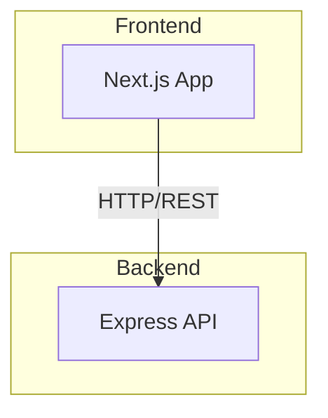
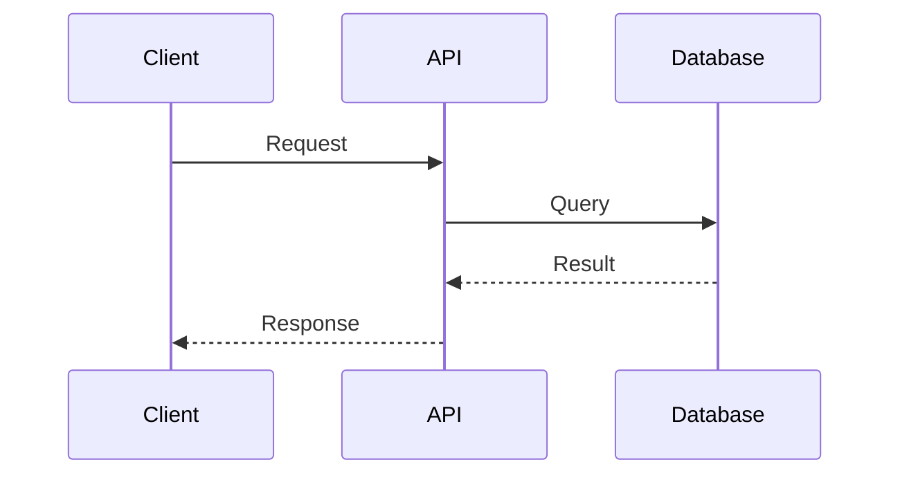
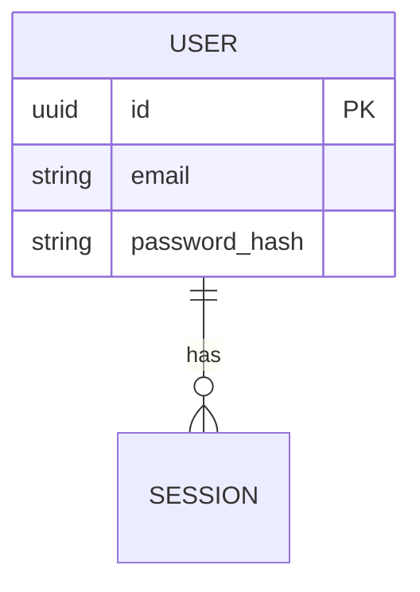
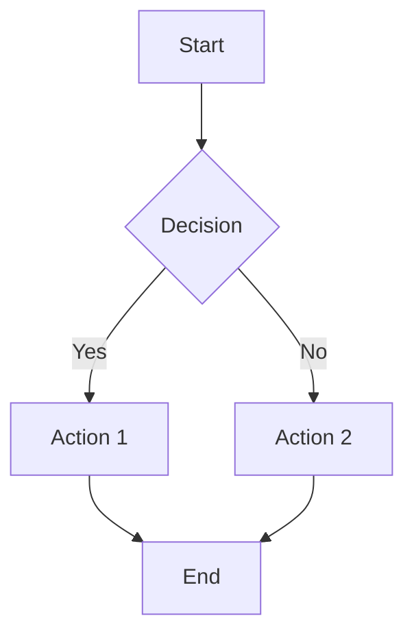

# Diagrams Skill

**Trigger:** Invoked by `/init` or `/diagrams`

This skill generates and maintains all Mermaid diagrams and flow documentation for the project.

## Diagram Generation Rules

### General Rules
- **ALWAYS use Mermaid syntax** inside markdown fences: ` ```mermaid ... ``` `
- **ALWAYS add a "Last Updated" timestamp** at the top of each file
- **ALWAYS add a brief plain-English explanation** above each diagram
- **UPDATE a diagram** if new modules, routes, models, or services are detected
- **NEVER delete a diagram** — if a component is removed, mark it as `[REMOVED]` in the diagram
- **USE consistent styling** across all diagrams

---

## Diagrams to Generate in `docs/diagrams/`

### 1. architecture.md
Generate a Mermaid C4 or graph TD diagram showing:
- Top-level system components detected in source directories
- External dependencies (databases, APIs, queues) inferred from package.json and config files
- Connections between components based on imports and configuration

**Detection sources:**
- `arkon-frontend/` → Next.js frontend
- `arkon-backend/` → Express API server
- `docker-compose.yml` → Infrastructure services
- Package.json dependencies → External integrations

### 2. dependencies.md
Generate a Mermaid graph showing:
- All major packages from package.json files as nodes
- Group by category: Web Framework, Database, Auth, UI, Testing, DevTools
- Show which source modules depend on which packages

**Categories to detect:**
- **Web**: next, react, express, cors, helmet
- **Database**: pg, prisma, drizzle, timescaledb
- **Auth**: jsonwebtoken, bcryptjs, passport
- **UI**: radix-ui, tailwindcss, framer-motion, lucide-react
- **Real-time**: ws, socket.io, web-push
- **Validation**: zod, joi, yup
- **Testing**: vitest, jest, playwright, supertest

### 3. data-model.md
If ORM models or database schemas are detected:
- Generate a Mermaid erDiagram showing entities and relationships
- Infer relationships from migration files or schema definitions
- If no models found, write a placeholder with instructions for adding models

**Detection sources:**
- `**/migrations/*.ts` or `**/migrations/*.sql`
- `**/models/*.ts`
- `**/schema/*.ts`
- Prisma schema files
- TypeORM entities

### 4. deployment.md
If docker-compose.yml, Dockerfile, or k8s/ detected:
- Generate a Mermaid graph showing services, ports, volumes, and networks
- Include health check information
- Show service dependencies

**Detection sources:**
- `docker-compose.yml` → Service definitions
- `**/Dockerfile` → Container builds
- `k8s/` or `kubernetes/` → Kubernetes manifests
- `.github/workflows/` → CI/CD pipelines

---

## Flows to Generate in `docs/flows/`

### 1. request-flow.md
Generate a Mermaid sequenceDiagram showing:
- A typical API request lifecycle from client to response
- Middleware chain (cors, helmet, auth, validation)
- Service layer processing
- Database interactions
- Response formatting

**Label each step with actual detected module names.**

### 2. auth-flow.md
If auth libraries detected (jsonwebtoken, bcryptjs, passport):
- Generate a Mermaid sequenceDiagram for:
  - User registration
  - User login
  - Token generation/validation
  - Protected route access
  - Token refresh (if applicable)

**Detection sources:**
- Routes containing `auth`, `login`, `register`
- JWT middleware
- bcrypt usage for password hashing

### 3. data-flow.md
Generate a Mermaid flowchart showing:
- How data enters the system (API endpoints, WebSocket, scheduled jobs)
- Validation layer (zod, joi)
- Processing/transformation
- Persistence (database writes)
- Response/notification

**Infer from detected frameworks and directory structure.**

### 4. error-flow.md
Generate a Mermaid flowchart showing:
- How errors and exceptions propagate through the system
- Where they are caught (middleware, service layer)
- How they are logged (pino, winston)
- How they are returned to the client (error response format)

**Detection sources:**
- Error middleware files
- Try/catch patterns
- Logger configuration

---

## Index Files

### docs/diagrams/index.md
After generating diagrams, update the index:
```markdown
# Architecture Diagrams

| File | Description | Last Updated |
|------|-------------|--------------|
| architecture.md | System component overview | YYYY-MM-DD |
| dependencies.md | Package dependency graph | YYYY-MM-DD |
| data-model.md | Entity relationship diagram | YYYY-MM-DD |
| deployment.md | Deployment and infrastructure | YYYY-MM-DD |
```

### docs/flows/index.md
After generating flows, update the index:
```markdown
# Flow Diagrams

| File | Description | Last Updated |
|------|-------------|--------------|
| request-flow.md | API request lifecycle | YYYY-MM-DD |
| auth-flow.md | Authentication flow | YYYY-MM-DD |
| data-flow.md | Data processing pipeline | YYYY-MM-DD |
| error-flow.md | Error propagation handling | YYYY-MM-DD |
```

---

## Mermaid Style Guide

### Graph Diagrams


### Sequence Diagrams


### ER Diagrams


### Flowcharts

