# System Architecture

**Last Updated:** 2026-05-06 (init sync)

## Overview

This diagram shows the high-level architecture of the Arkon AI Gateway platform. The platform is a pnpm + Turborepo monorepo with a Next.js frontend, Express API backend, PostgreSQL with TimescaleDB and pgvector for data storage, and integrated LLM/RAG capabilities.

```mermaid
graph TD
    subgraph Clients["Client Layer"]
        Browser["Browser"]
        Mobile["Mobile App"]
        CLI["CLI Tools"]
        AIAgents["AI Agents"]
    end

    subgraph Frontend["Frontend (apps/web - Next.js 15)"]
        NextApp["Next.js App Router"]
        RSC["React Server Components"]
        ClientComp["Client Components"]
        ReactFlow["React Flow<br/>Agent Topology"]
        Recharts["Recharts<br/>Analytics"]
        CMDK["Command Palette<br/>(cmdk)"]
    end

    subgraph Backend["Backend API (apps/api - Express 4.21)"]
        subgraph Middleware["Middleware Layer"]
            Morgan["Morgan Logging"]
            Helmet["Helmet Security"]
            CORS["CORS"]
            Compress["Compression"]
            Auth["JWT Auth"]
            RBAC["RBAC"]
            RateLimit["Rate Limiter"]
        end

        subgraph Routes["Route Handlers"]
            AuthRoutes["Auth / OAuth"]
            AgentRoutes["Agents"]
            EventRoutes["Events"]
            DashboardRoutes["Dashboard"]
            WorkflowRoutes["Workflows"]
            IncidentRoutes["Incidents"]
            AnalyticsRoutes["Analytics"]
            CostRoutes["Costs"]
            SecurityRoutes["Security"]
            ComplianceRoutes["Compliance"]
            GatewayRoutes["Gateway"]
            SkillsRoutes["Skills"]
            LLMRoutes["LLM"]
            RAGRoutes["RAG"]
            RAGChatRoutes["RAG Chat"]
            RAGAdminRoutes["RAG Admin"]
            EmbeddingRoutes["Embedding"]
            MCPRoutes["MCP"]
            TeamsRoutes["Teams"]
            UsageRoutes["Usage"]
            ModelsRoutes["Models"]
            VirtualKeysRoutes["Virtual Keys"]
            RoutingRoutes["CLI Routing"]
        end

        subgraph Services["Services"]
            AuditSvc["Audit Service"]
            SkillsSvc["Skills Service"]
            LLMSvc["LLM Service"]
            RAGSvc["RAG Service"]
            RAGChatSvc["RAG Chat Service"]
            RAGRetrieverSvc["RAG Retriever"]
            AdvRAGSvc["Advanced RAG"]
            EmbeddingSvc["Embedding Service"]
            SearchSvc["Search Service"]
            MCPSvc["MCP Service"]
            ModelsSvc["Models Service"]
            LiteLLMSvc["LiteLLM Orchestrator"]
            ToolboxSvc["Toolbox Service"]
            SecretVault["Secret Vault"]
        end

        subgraph LLMProviders["LLM Providers"]
            Anthropic["Anthropic Claude"]
            Cerebras["Cerebras"]
            Ollama["Ollama (Local)"]
        end

        subgraph Realtime["Real-time"]
            WS["WebSocket Server"]
            WebPush["Web Push"]
        end

        subgraph Libs["Libraries"]
            DB["db.ts (Prisma)"]
            JWT["jwt.ts"]
            OAuth["oauth.ts (Arctic)"]
            AuditLib["audit.ts"]
        end
    end

    subgraph Data["Data Layer (PostgreSQL 15)"]
        PG["PostgreSQL"]
        TS["TimescaleDB<br/>(Time-series)"]
        PGVector["pgvector<br/>(Embeddings)"]
    end

    subgraph SharedPkgs["Shared Packages"]
        Database["@arkon/database<br/>(Prisma)"]
        Shared["@arkon/shared<br/>(Types)"]
        TSConfig["@arkon/tsconfig"]
        EngineCore["engine-core<br/>(Rust)"]
        CLIPkg["@arkon/cli<br/>(CLI Tool)"]
    end

    Browser --> NextApp
    Mobile --> NextApp
    CLI --> Backend
    AIAgents --> Backend

    NextApp --> RSC
    RSC --> ClientComp
    ClientComp --> ReactFlow
    ClientComp --> Recharts
    ClientComp --> CMDK

    NextApp -->|REST API| Middleware
    Middleware --> Routes
    Routes --> Services
    Services --> Libs
    Services --> LLMProviders
    Libs --> Database
    Database --> PG
    PG --> TS
    PG --> PGVector

    WS -.->|Events| Browser
    WebPush -.->|Notifications| Browser

    Backend --> SharedPkgs
    Frontend --> SharedPkgs
```

## Component Descriptions

| Component | Technology | Purpose |
|-----------|------------|---------|
| Next.js App | Next.js 15, React 19 | Server-side rendering, routing, API proxy |
| Express API | Express 4.21 | REST API, business logic, authentication |
| PostgreSQL | PostgreSQL 15 | Relational data storage |
| TimescaleDB | TimescaleDB extension | Time-series event data |
| pgvector | pgvector extension | Vector embeddings for semantic search |
| Prisma | Prisma 5.22 | Type-safe ORM |
| WebSocket | ws 8.20 | Real-time event streaming |
| Web Push | web-push 3.6 | Push notifications |
| Anthropic | @anthropic-ai/sdk | Claude LLM API |
| OpenAI | openai SDK | Text embeddings |
| Arctic | arctic 2.1 | OAuth 2.0 (GitHub) |

## External Integrations

The system integrates with:
- **LLM Providers**: Anthropic Claude, Cerebras, Ollama (local)
- **Embedding Providers**: OpenAI text-embedding-3-small
- **OAuth Providers**: GitHub
- **Monitoring**: Custom event ingestion
- **Notifications**: Web Push API
