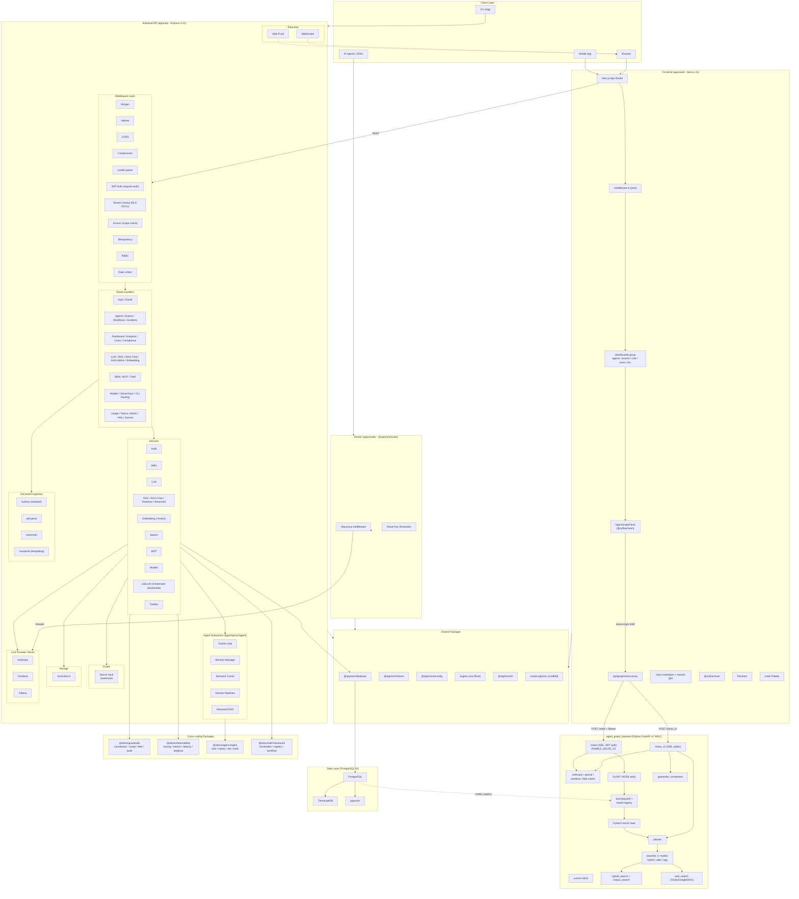

# System Architecture

**Last Updated:** 2026-05-15 (init sync — KnowledgeSearchBackend renamed to agent_graph_backend, added authenticated `/solve` path + DB/Vault/JWT modules)

## Overview

This diagram shows the high-level architecture of the OppMon (Arkon) AI Gateway platform. The platform is a pnpm + Turborepo monorepo with a Next.js frontend, an Express API, a dedicated LiteLLM proxy router, a Python FastAPI `agent_graph_backend` (formerly `KnowledgeSearchBackend`) for graph-mode chat (`/solve_v2` + authenticated `/solve` per ADR-0014), PostgreSQL with TimescaleDB and pgvector for storage, and a layered agent subsystem with guardrails and observability packages.

## Component Descriptions

| Component | Technology | Purpose |
|-----------|------------|---------|
| Next.js App | Next.js 15, React 19 | UI, routing, dashboards |
| Frontend Auth Middleware | jose 5.2 | JWT verification at the edge |
| Express API | Express 4.21 | REST API, business logic |
| Router | http-proxy-middleware 3.0 | Per-tenant LiteLLM proxy |
| Agent Graph Backend | FastAPI 0.115 + Uvicorn 0.32 | Graph-mode planner+searcher DAG, `/solve_v2` (public) + `/solve` (JWT auth, behind `ENABLE_SOLVE_V3`) |
| Graph Proxy (web) | Next.js Route Handler | Same-origin SSE proxy → agent_graph_backend |
| Agent Graph Auth | PyJWT 2.10 + asyncpg 0.30 | HS256 verify, tenant-scoped model registry (TAG-51/52/57) |
| Agent Graph Vault | PyNaCl 1.5 (XSalsa20-Poly1305) | Cross-language parity with `apps/api`'s `tweetnacl` vault (TAG-54) |
| Agent Graph Panel | @xyflow/react | Live DAG visualization for graph-mode chat |
| PostgreSQL | PostgreSQL 15 | Relational data |
| TimescaleDB | TimescaleDB extension | Time-series events |
| pgvector | pgvector extension | Vector embeddings |
| Prisma | Prisma 5.22 | Type-safe ORM |
| WebSocket | ws 8.20 | Real-time event streaming |
| Web Push | web-push 3.6 | Push notifications |
| Anthropic | @anthropic-ai/sdk | Claude LLM |
| OpenAI | openai SDK | Embeddings |
| Arctic | arctic 2.1 | OAuth 2.0 (GitHub) |
| Dockerode | dockerode 4.0 | Manage LiteLLM containers |
| busboy / pdf-parse / mammoth | varies | Document ingestion |
| tweetnacl | tweetnacl 1.0 | XChaCha20-Poly1305 secret vault |

## External Integrations

- **LLM Providers**: Anthropic Claude, Cerebras, Ollama (local), plus tenant LiteLLM
- **Embedding Providers**: OpenAI text-embedding-3-small
- **OAuth Providers**: GitHub (via Arctic)
- **Observability (optional)**: Langfuse, prom-client (peer deps)
- **Notifications**: Web Push
