# Data Model

**Last Updated:** 2026-05-05

## Overview

This diagram shows the entity-relationship model for the Arkon platform as defined in `packages/database/prisma/schema.prisma`. The schema supports multi-tenancy, OAuth, skills registry, LLM sessions, and vector embeddings.

```mermaid
erDiagram
    TENANT ||--o{ USER : has
    TENANT ||--o{ TEAM : has
    TENANT ||--o{ AGENT : owns
    TENANT ||--o{ SKILL : owns
    TENANT ||--o{ AUDIT_LOG : tracks
    TENANT ||--o{ LLM_SESSION : owns
    TENANT ||--o{ EMBEDDING : stores
    TENANT ||--o{ MCP_SERVER : registers

    TEAM ||--o{ TEAM_MEMBER : has
    TEAM ||--o{ AGENT : "optionally owns"
    TEAM ||--o{ SKILL : "optionally owns"
    TEAM ||--o{ MCP_SERVER : "optionally owns"

    USER ||--o{ USER_SESSION : has
    USER ||--o{ TEAM_MEMBER : belongs_to
    USER ||--o{ OAUTH_ACCOUNT : has
    USER ||--o{ NOTIFICATION : receives
    USER ||--o{ INCIDENT_UPDATE : creates
    USER ||--o{ SKILL : creates
    USER ||--o{ SKILL_VERSION : creates
    USER ||--o{ AUDIT_LOG : "actor in"
    USER ||--o{ LLM_SESSION : owns

    AGENT ||--o{ EVENT : generates
    AGENT ||--o{ INCIDENT : triggers

    INCIDENT ||--o{ INCIDENT_UPDATE : has

    WORKFLOW ||--o{ WORKFLOW_RUN : executes

    SKILL ||--o{ SKILL_VERSION : "has versions"

    LLM_SESSION ||--o{ LLM_MESSAGE : contains

    TENANT {
        string id PK
        string name
        string slug UK
        boolean isActive
        datetime createdAt
        datetime updatedAt
    }

    TEAM {
        string id PK
        string name
        string tenantId FK
        datetime createdAt
        datetime updatedAt
    }

    USER {
        string id PK
        string email UK
        string passwordHash
        string name
        enum role "TENANT_ADMIN|TEAM_ADMIN|MEMBER"
        string tenantId FK
        boolean isActive
        datetime createdAt
        datetime updatedAt
    }

    USER_SESSION {
        string id PK
        string userId FK
        string token UK
        datetime expiresAt
        datetime createdAt
        string userAgent
        string ipAddress
    }

    OAUTH_ACCOUNT {
        string id PK
        string userId FK
        enum provider "GITHUB|GOOGLE"
        string providerAccountId
        string accessToken
        string refreshToken
        datetime expiresAt
        datetime createdAt
        datetime updatedAt
    }

    TEAM_MEMBER {
        string id PK
        string userId FK
        string teamId FK
        enum role "ADMIN|MEMBER"
        datetime createdAt
    }

    AGENT {
        string id PK
        string name
        string description
        enum status "ACTIVE|INACTIVE|ERROR|PENDING"
        string tenantId FK
        string teamId FK
        json config
        datetime lastSeen
        datetime createdAt
        datetime updatedAt
    }

    EVENT {
        string id PK
        string agentId FK
        string eventType
        json payload
        string severity
        datetime timestamp
    }

    INCIDENT {
        string id PK
        string agentId FK
        string title
        string description
        enum severity "LOW|MEDIUM|HIGH|CRITICAL"
        enum status "OPEN|INVESTIGATING|RESOLVED|CLOSED"
        datetime createdAt
        datetime resolvedAt
    }

    INCIDENT_UPDATE {
        string id PK
        string incidentId FK
        string userId FK
        string message
        datetime createdAt
    }

    NOTIFICATION {
        string id PK
        string userId FK
        string type
        string title
        string message
        boolean isRead
        datetime createdAt
    }

    WORKFLOW {
        string id PK
        string name
        string description
        string tenantId
        json definition
        boolean isActive
        datetime createdAt
        datetime updatedAt
    }

    WORKFLOW_RUN {
        string id PK
        string workflowId FK
        string status
        json context
        datetime startedAt
        datetime completedAt
    }

    SKILL {
        string id PK
        string tenantId FK
        string teamId FK
        string name
        string description
        int version
        string content
        string sha256
        enum scope "TENANT|TEAM"
        string createdById FK
        datetime createdAt
        datetime updatedAt
        datetime deletedAt
    }

    SKILL_VERSION {
        string id PK
        string skillId FK
        int version
        string content
        string sha256
        string createdById FK
        datetime createdAt
    }

    AUDIT_LOG {
        string id PK
        string tenantId FK
        string resourceType
        string resourceId
        enum action "CREATE|READ|UPDATE|DELETE|DENIED"
        string actorId FK
        json beforeState
        json afterState
        string ipAddress
        string userAgent
        json metadata
        datetime createdAt
    }

    LLM_SESSION {
        string id PK
        string tenantId FK
        string userId FK
        string title
        string provider
        datetime createdAt
        datetime updatedAt
    }

    LLM_MESSAGE {
        string id PK
        string sessionId FK
        string provider
        string model
        string role
        string content
        int inputTokens
        int outputTokens
        datetime createdAt
    }

    EMBEDDING {
        string id PK
        string tenantId FK
        string sourceType
        string sourceId
        string content
        string contentHash
        string provider
        string model
        int dimensions
        json metadata
        datetime createdAt
        datetime updatedAt
    }

    MCP_SERVER {
        string id PK
        string tenantId FK
        string teamId FK
        string name UK
        string description
        string command
        array args
        json env
        string version
        string sha256
        enum scope "TENANT|TEAM"
        boolean enabled
        datetime createdAt
        datetime updatedAt
        datetime deletedAt
    }
```



## Multi-Tenancy Model

```
Tenant
  ├── Users (role: TENANT_ADMIN | TEAM_ADMIN | MEMBER)
  │     └── OAuthAccounts (GITHUB, GOOGLE)
  │     └── UserSessions
  │     └── Notifications
  ├── Teams
  │     └── TeamMembers (role: ADMIN | MEMBER)
  ├── Agents
  │     └── Events (time-series)
  │     └── Incidents → IncidentUpdates
  ├── Workflows → WorkflowRuns
  ├── Skills → SkillVersions
  ├── AuditLogs
  ├── LlmSessions → LlmMessages
  ├── Embeddings (pgvector)
  └── McpServers
```

## PostgreSQL Extensions

The database uses three PostgreSQL extensions:

| Extension | Purpose |
|-----------|---------|
| **TimescaleDB** | Time-series optimization for Events table |
| **pgvector** | Vector embeddings for semantic search |
| **uuid-ossp** | UUID generation (via Prisma CUID) |

## Time-Series Data (TimescaleDB)

The `events` table is configured as a TimescaleDB hypertable:

```sql
-- Hypertable configuration
SELECT create_hypertable('events', 'timestamp');

-- Retention policy (example: 90 days)
SELECT add_retention_policy('events', INTERVAL '90 days');

-- Continuous aggregate for hourly stats
CREATE MATERIALIZED VIEW event_hourly
WITH (timescaledb.continuous) AS
SELECT
    time_bucket('1 hour', timestamp) AS bucket,
    "agentId",
    "eventType",
    COUNT(*) as count
FROM events
GROUP BY bucket, "agentId", "eventType";
```

## Vector Embeddings (pgvector)

The `embeddings` table stores vector representations:

```sql
-- Add vector column (done via migration)
ALTER TABLE embeddings ADD COLUMN embedding vector(1536);

-- Create HNSW index for fast similarity search
CREATE INDEX ON embeddings
USING hnsw (embedding vector_cosine_ops)
WITH (m = 16, ef_construction = 64);

-- Semantic search query
SELECT sourceType, sourceId, content,
       1 - (embedding <=> $1::vector) AS similarity
FROM embeddings
WHERE "tenantId" = $2
ORDER BY embedding <=> $1::vector
LIMIT 10;
```

## Key Indexes

| Table | Index | Columns |
|-------|-------|---------|
| events | idx_events_agent_time | (agentId, timestamp DESC) |
| events | idx_events_type_time | (eventType, timestamp DESC) |
| agents | idx_agents_tenant | (tenantId) |
| agents | idx_agents_status | (status) |
| users | idx_users_email | (email) |
| users | idx_users_tenant | (tenantId) |
| incidents | idx_incidents_status | (status, createdAt DESC) |
| skills | idx_skills_tenant | (tenantId) |
| skills | idx_skills_scope | (scope) |
| audit_logs | idx_audit_tenant_type | (tenantId, resourceType, createdAt DESC) |
| embeddings | idx_embeddings_source | (tenantId, sourceType, sourceId) |
| mcp_servers | idx_mcp_servers_tenant | (tenantId) |
| mcp_servers | idx_mcp_servers_scope | (scope) |
