# Data Model

**Last Updated:** 2026-05-10 (post schema improvement plan: audit/memory/notifications consolidation, outbox + idempotency + soft-delete + embedding versioning, TimescaleDB tuning)

## Overview

The OppMon (Arkon) database is a hybrid Prisma-managed + raw-SQL schema running
on PostgreSQL 15 with two extensions: **TimescaleDB** (time-series) and
**pgvector** (semantic search).

- **Prisma owns** the core multi-tenant tables (Tenant, User, Team, Agent,
  etc.) defined in `packages/database/prisma/schema.prisma` and applied via
  `prisma db push`.
- **Raw SQL migrations** under `apps/api/scripts/migrations/` add features
  Prisma can't model: pgvector columns, TimescaleDB hypertables, RLS
  policies, triggers, full-text search, the journal/memory subsystems, and
  RAG. The migration runner is `apps/api/scripts/migrate.ts` (sorts `*.sql`
  files alphabetically, tracks state in `_migrations`).
- **All IDs are TEXT/cuid.** Legacy `SERIAL/INTEGER` ids were converted to
  `TEXT PRIMARY KEY DEFAULT gen_random_uuid()::text` during the 2026-05-09
  cutover. See [WIP-2026-05-09 cutover doc](../decisions/WIP-2026-05-09-migration-id-cutover.md).
- **Column naming:** snake_case in Postgres; Prisma fields are camelCase
  with `@map()`. See [database-conventions.md](../database-conventions.md).

There are ~80 tables grouped into 11 logical domains. The high-level domain
map is shown first; per-domain ERDs follow; a full table inventory closes
the document.

---

## Domain Map

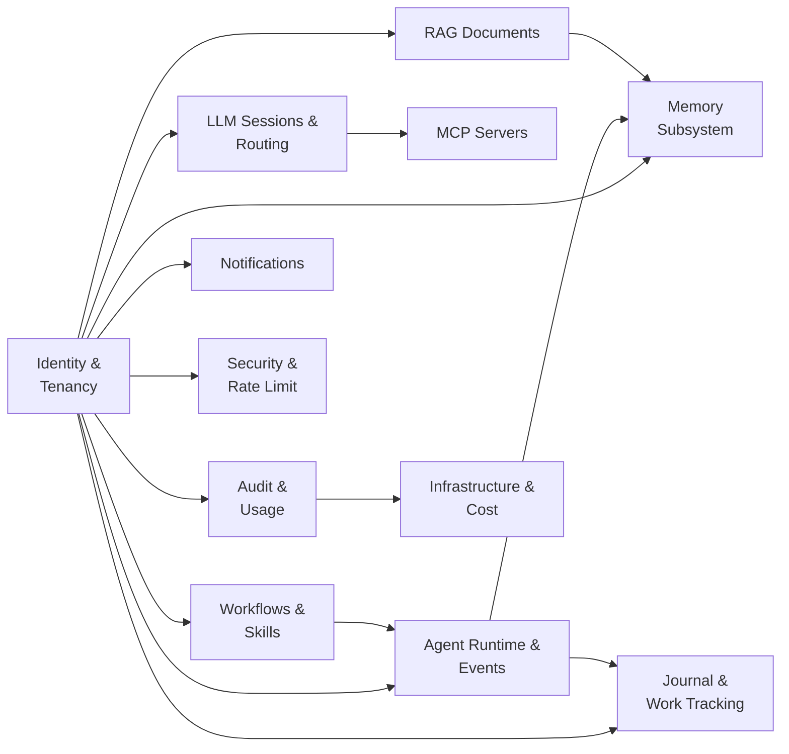

---

## 1. Identity & Tenancy

The root of the multi-tenant model. Every tenant-scoped table FKs to
`tenants(id)` with `ON DELETE CASCADE`.

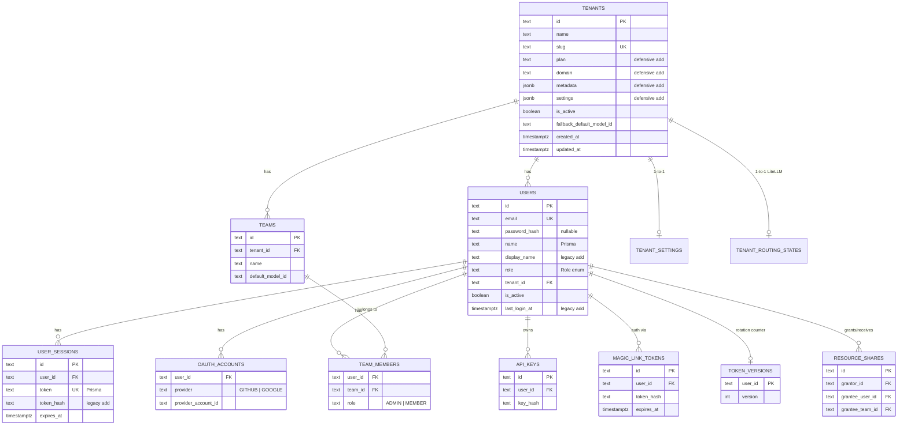

**Special tenants:** `default` (seeded in `001_create_tenants.sql`),
`transformate` (seeded in `017_journal.sql`), `system` (seeded in
`2026-05-08_rls_and_rbac.sql` for SYSTEM_ADMIN ops).

---

## 2. Agent Runtime & Events

Time-series-heavy; `events` is a TimescaleDB hypertable.

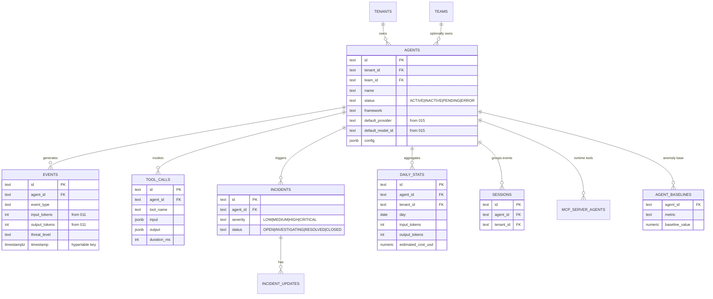

---

## 3. LLM Sessions, Routing & MCP

Tenant-scoped LLM sessions plus the LiteLLM-backed routing config and MCP
server registry.

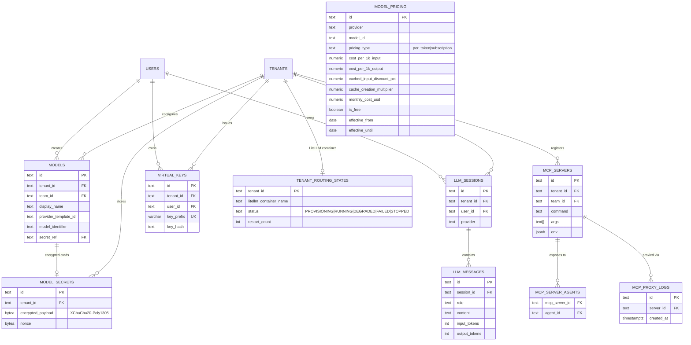

`model_pricing` is a global rate-card table (no tenant_id). Seeded with 63
rows (Anthropic 11, OpenAI 21, Cerebras 10, Ollama 21) by
`2026-05-09_seed_model_pricing.sql`.

---

## 4. Memory Subsystem

Two parallel memory designs coexist:

- **memory_facts** (`018_memory_v2.sql`) — pgvector 1536-dim, MRL-truncated,
  per-(tenant, agent) fact store with HNSW or IVFFlat index based on
  pgvector version.
- **8-table memory bank** (`024_prisma_schema_alignment.sql`) — pgvector
  1024-dim (BGE-M3), one table per memory type.

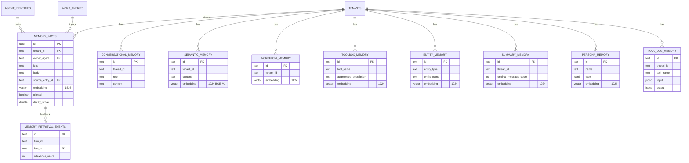

**Note:** Prisma cannot model `vector(N)` columns. The `embedding` columns
on these tables are added defensively in `024_prisma_schema_alignment.sql`
right before the HNSW index creation block (consolidation 2026-05-09).

---

## 5. RAG (Retrieval-Augmented Generation)

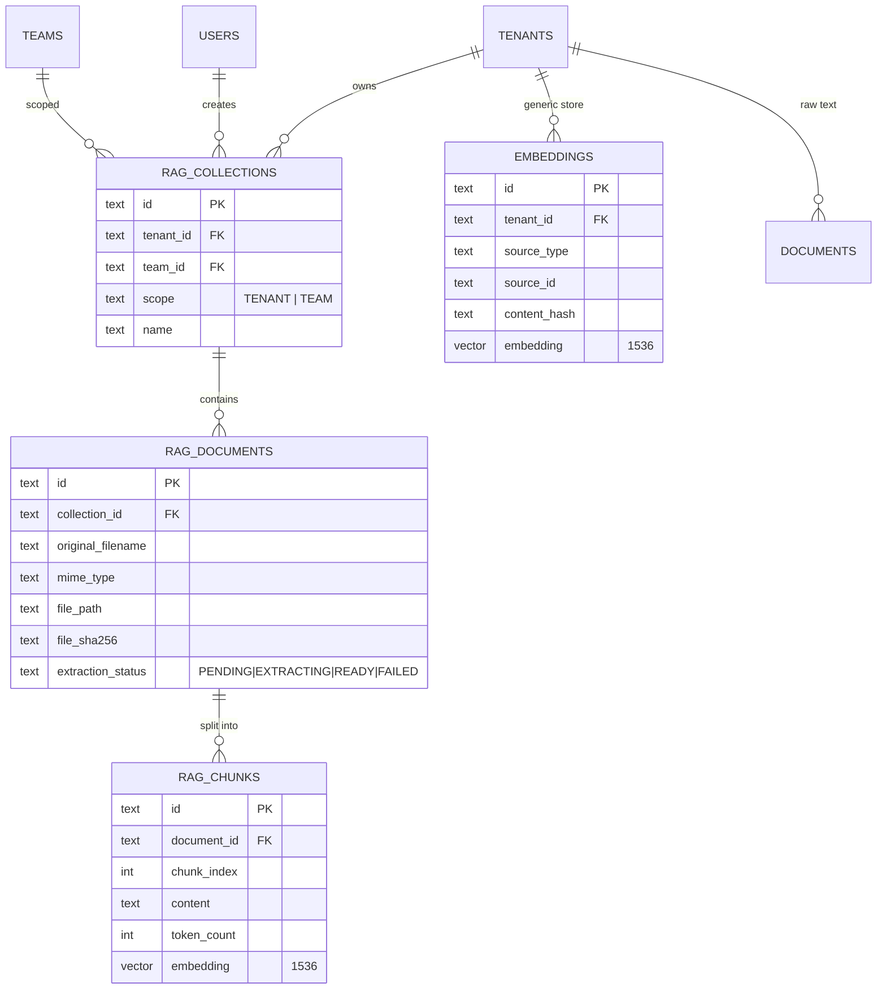

Both `rag_chunks.embedding` and `embeddings.embedding` are added
defensively in `024_prisma_schema_alignment.sql`. The `documents` table is
a generic raw-text store separate from the RAG pipeline.

---

## 6. Journal & Work Tracking

The Warden + governed-agent unified work tracker introduced in
`017_journal.sql` plus the work-items system from `020_work_items.sql`.

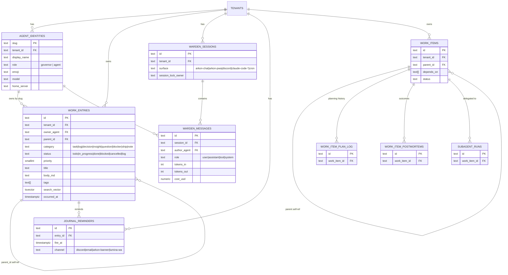

`agent_identities` is seeded with 8 agents for the `transformate` tenant:
warden, brynn, lumina, sentinel, scout, codesmith, hermes, opus-desktop.

---

## 7. Workflows, Skills & Tasks

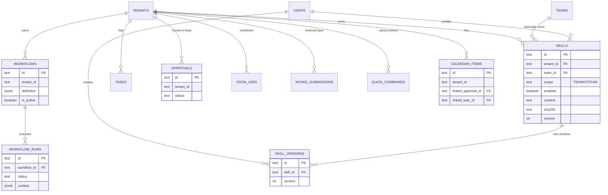

---

## 8. Audit, Usage & Pricing

Three coexisting audit/usage tables for different fidelity levels:

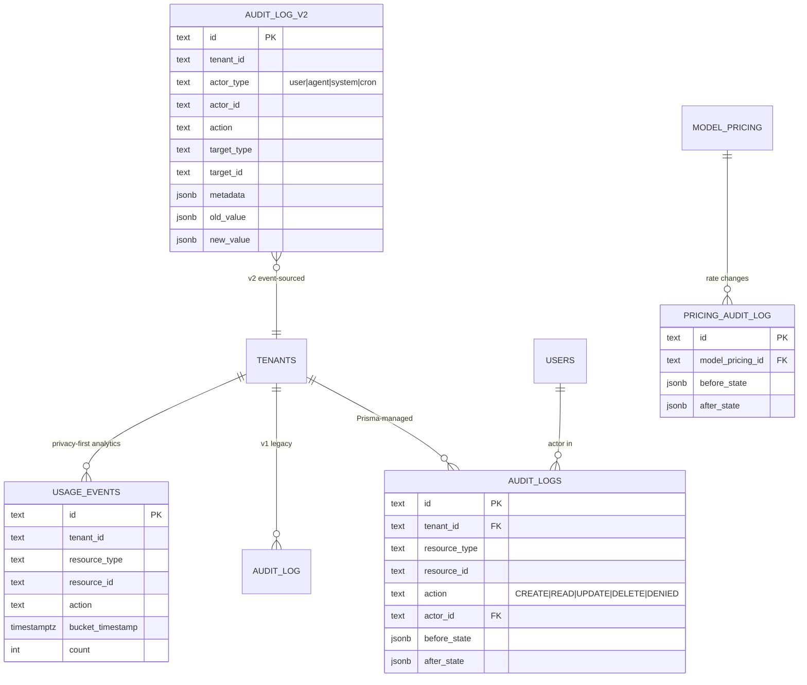

`audit_log_v2` is append-only — `REVOKE UPDATE, DELETE` is conditionally
applied to the `mcadmin` role (production only) and a BEFORE INSERT
trigger enforces tenant_id integrity (`2026-05-08_rls_and_rbac.sql`).

---

## 9. Notifications

Two parallel notification stacks:

- **`notifications` (Prisma)**: per-user, simple `is_read` flag.
- **`notifications` (legacy raw SQL)**: per-tenant, severity, body, link,
  `read` flag. The same table — columns are added defensively to
  reconcile both shapes.

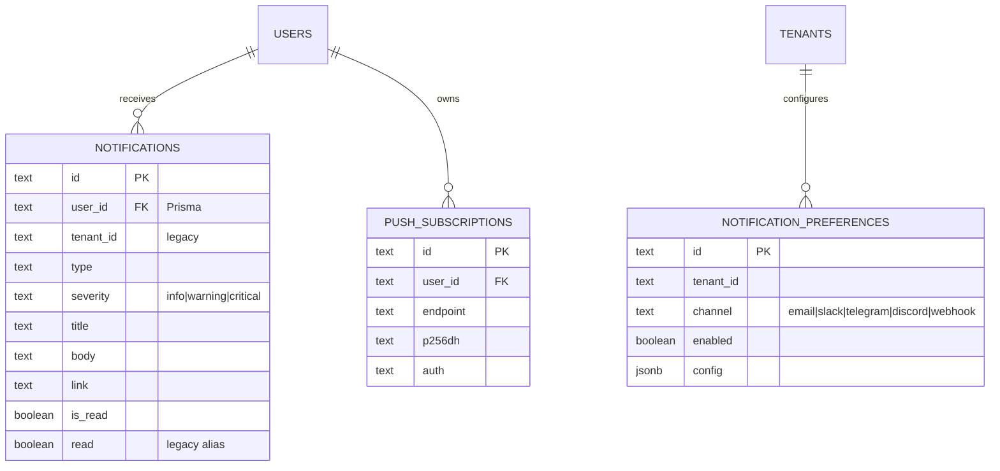

---

## 10. Infrastructure, Cost & Tracing

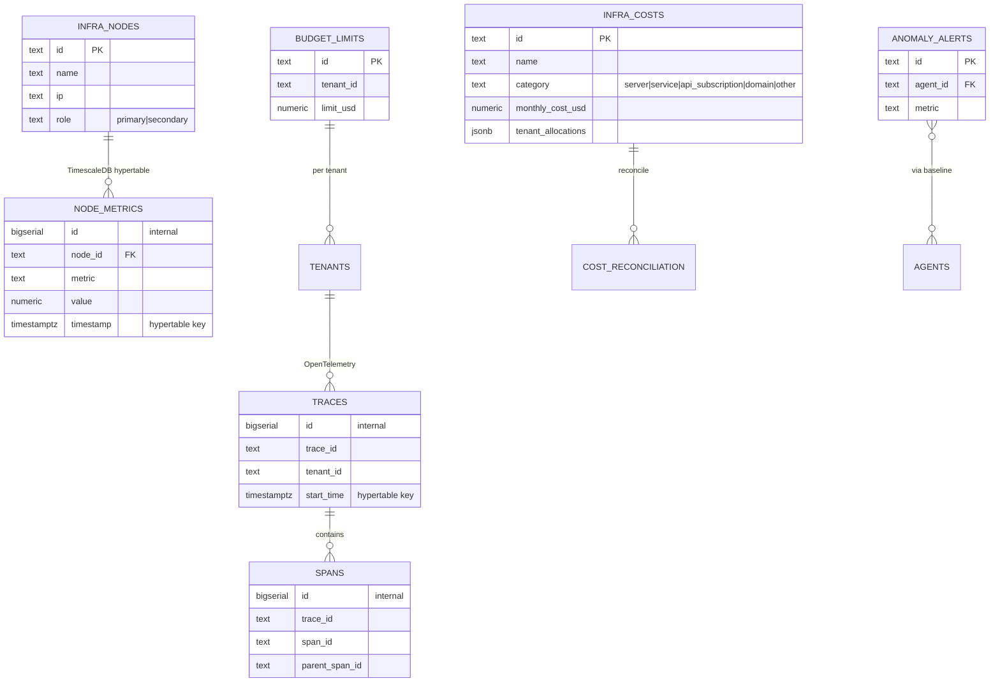

`node_metrics`, `traces`, `spans` keep `BIGSERIAL` internal `id` (TimescaleDB
hypertable counter — no FK target).

---

## 11. Security & Rate Limit

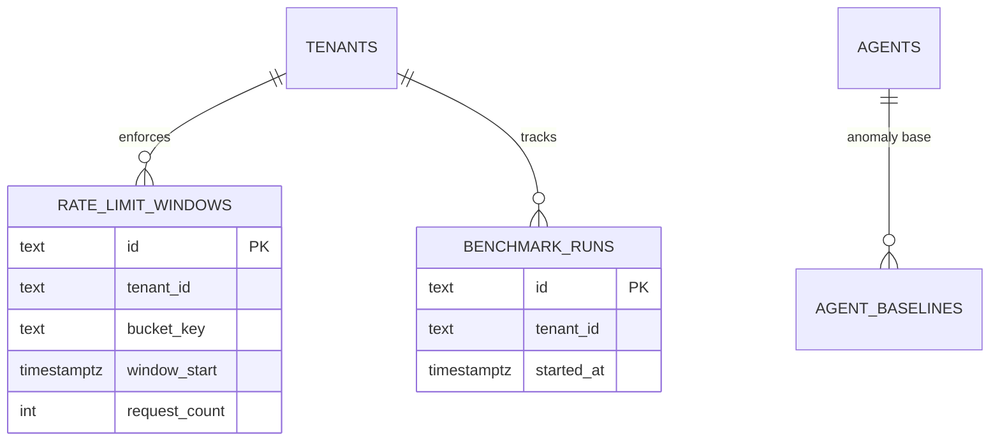

Plus RLS policies (`2026-05-08_rls_and_rbac.sql`) on every tenant-scoped
table, the `oppmon_app` `NOSUPERUSER NOBYPASSRLS` DB role, and a BEFORE
INSERT audit_logs trigger for defense-in-depth.

---

## Full Table Inventory

**Expected scale legend:** `small` ≤10k rows, `medium` ≤1M, `large` ≤100M, `hypertable` = TimescaleDB-partitioned (effectively unbounded but with retention/compression).

| # | Table | Source | Purpose | Expected scale |
|---|---|---|---|---|
| 1 | `tenants` | Prisma + 001 | Multi-tenant root | small |
| 2 | `users` | Prisma + 006 | Operator accounts | small |
| 3 | `user_sessions` | Prisma + 006 | JWT/session store | medium |
| 4 | `oauth_accounts` | Prisma | GitHub/Google OAuth | small |
| 5 | `teams` | Prisma | Sub-tenant grouping | small |
| 6 | `team_members` | Prisma | User↔Team M2M | small |
| 7 | `tenant_settings` | Prisma | Per-tenant flags | small |
| 8 | `tenant_routing_states` | Prisma | LiteLLM container status | small |
| 9 | `token_versions` | Prisma multitenant_redesign | JWT rotation counter | small |
| 10 | `resource_shares` | Prisma multitenant_redesign | Cross-user resource grants | small |
| 11 | `api_keys` | 010 | API key auth | small |
| 12 | `magic_link_tokens` | 010 | Passwordless email auth | small |
| 13 | `agents` | Prisma + 015 | Registered agents | medium |
| 14 | `events` | Prisma + 011 | Time-series events | **hypertable** (since 2026-05-10) |
| 15 | `tool_calls` | 024 | Per-tool invocations | **hypertable** (since 2026-05-10) |
| 16 | `daily_stats` | 011 + 024 | Daily aggregates (deprecated by `daily_stats_cagg`) | medium |
| 17 | `sessions` | 001 | Agent conversation sessions | medium |
| 18 | `incidents` | Prisma | Incident records | medium |
| 19 | `incident_updates` | Prisma | Incident comments | medium |
| 20 | `agent_baselines` | base_schema | Anomaly baselines | small |
| 21 | `agent_identities` | 017 | Warden agent registry | small |
| 22 | `mcp_servers` | Prisma + 024 | MCP server registry | small |
| 23 | `mcp_server_agents` | base_schema | MCP↔Agent M2M | small |
| 24 | `mcp_proxy_logs` | base_schema | MCP request log | **hypertable** (since 2026-05-10) |
| 25 | `models` | Prisma | Per-tenant model config | small |
| 26 | `model_secrets` | Prisma | Encrypted provider creds | small |
| 27 | `model_pricing` | base_schema + 015 + 022 + 2026-05-09 | Global rate cards | small |
| 28 | `pricing_audit_log` | base_schema | model_pricing change log | medium |
| 29 | `virtual_keys` | Prisma | API gateway keys | small |
| 30 | `llm_sessions` | Prisma | LLM chat sessions | medium |
| 31 | `llm_messages` | Prisma | LLM chat messages | **hypertable** (since 2026-05-10) |
| 32 | `embeddings` | Prisma + 024 | Generic vector store (1536) | large |
| 33 | `documents` | base_schema | Raw doc storage | medium |
| 34 | `rag_collections` | 024 | RAG collection grouping | small |
| 35 | `rag_documents` | 024 | RAG-indexed documents | medium |
| 36 | `rag_chunks` | 024 + 003 | RAG chunked content (1536) | large |
| 37 | `memory_facts` | 018 | Long-term agent memory (1536, MRL) — canonical store | large |
| 38 | `memory_retrieval_events` | 023 | Memory relevance feedback | medium |
| 39 | `conversational_memory` | 024 | Per-thread chat memory | medium |
| 40 | ~~`semantic_memory`~~ | 024 | **Dropped 2026-05-10** — folded into `memory_facts(kind='semantic')` | — |
| 41 | ~~`workflow_memory`~~ | 024 | **Dropped 2026-05-10** — folded into `memory_facts(kind='workflow')` | — |
| 42 | ~~`toolbox_memory`~~ | 024 | **Dropped 2026-05-10** — folded into `memory_facts(kind='toolbox')` | — |
| 43 | ~~`entity_memory`~~ | 024 | **Dropped 2026-05-10** — folded into `memory_facts(kind='entity')` | — |
| 44 | `summary_memory` | 024 | Conversation summaries (1024) | medium |
| 45 | `persona_memory` | 024 | Per-persona memory (1024) | small |
| 46 | `tool_log_memory` | 024 | Tool exec audit (memory layer) | medium |
| 47 | `work_entries` | 017 | Unified work tracker | medium |
| 48 | `warden_sessions` | 017 | Warden conv. continuity | medium |
| 49 | `warden_messages` | 017 | Warden session messages | large |
| 50 | `journal_reminders` | 017 | Reminder scheduler | small |
| 51 | `work_items` | 020 | Work-item tickets | medium |
| 52 | `work_item_plan_log` | 020 | Plan revision history | medium |
| 53 | `work_item_postmortems` | 020 | Outcome write-ups | small |
| 54 | `subagent_runs` | 020 | Delegated subagent runs | medium |
| 55 | `tasks` | base_schema | Generic tasks | medium |
| 56 | `approvals` | base_schema | Human-in-loop approvals | small |
| 57 | `cron_jobs` | base_schema | Scheduled jobs | small |
| 58 | `intake_submissions` | base_schema | External form intake | medium |
| 59 | `quick_commands` | base_schema | Saved command palette | small |
| 60 | `calendar_items` | base_schema | Calendar entries | medium |
| 61 | `workflows` | Prisma | Workflow definitions | small |
| 62 | `workflow_runs` | Prisma | Workflow exec records | large |
| 63 | `skills` | Prisma | Skill registry | small |
| 64 | `skill_versions` | Prisma | Skill version history | small |
| 65 | `audit_logs` | Prisma + 2026-05-08 | Resource audit log (deprecated; backfilled into `audit_log_v2` 2026-05-10) | medium |
| 66 | ~~`audit_log`~~ | base_schema | **Dropped 2026-05-10** — legacy v1, backfilled into `audit_log_v2` | — |
| 67 | `audit_log_v2` | 007 | Append-only event-sourced audit (canonical) | large |
| 68 | `usage_events` | Prisma | Privacy-first usage analytics | large |
| 69 | `notifications` | Prisma + 004 + 2026-05-10 | Per-user notifications (tenant-broadcast = fanout) | large |
| 70 | `notification_preferences` | 004 | Per-channel notification config | medium |
| 71 | `push_subscriptions` | 005 | Web push subscriptions | medium |
| 72 | `infra_nodes` | base_schema | Server/node registry | small |
| 73 | `node_metrics` | base_schema | Node telemetry | **hypertable** |
| 74 | `infra_costs` | 013 | Infrastructure cost tracker | medium |
| 75 | `cost_reconciliation` | 014 | Cost vs invoice reconciliation | medium |
| 76 | `budget_limits` | base_schema | Per-tenant spend caps | small |
| 77 | `traces` | 009 | OTel traces | **hypertable** |
| 78 | `spans` | 009 | OTel spans | **hypertable** |
| 79 | `anomaly_alerts` | base_schema | Anomaly alert records | medium |
| 80 | `rate_limit_windows` | 008 | Token-bucket rate limit state | **hypertable** |
| 81 | `benchmark_runs` | base_schema | Performance benchmarks | small |
| 82 | `_migrations` | migrate.ts | Migration runner state (now with checksum/duration/status, 2026-05-10) | small |
| 83 | `event_outbox` | 2026-05-10 | Transactional outbox for at-least-once event publishing | large |
| 84 | `idempotency_keys` | 2026-05-10 | Replay-protection cache for mutating endpoints | medium |
| 85 | `tenant_archives` | 2026-05-10 | Frozen JSONB snapshot per tenant deletion (immutable) | small |
| 86 | `tenant_deletion_audit` | 2026-05-10 | GDPR proof-of-deletion receipts (immutable) | small |

**Net: 81 active tables** post-2026-05-10 consolidation (5 dropped — `audit_log`, `semantic_memory`, `workflow_memory`, `toolbox_memory`, `entity_memory`; 4 added — `event_outbox`, `idempotency_keys`, `tenant_archives`, `tenant_deletion_audit`). `youtube_channels` was created in 016 and dropped in 021, not counted.

---

## Migration Consolidation Patterns (2026-05-09)

The migration cutover converted ALL `SERIAL`/`INTEGER` ids to
`TEXT`/`gen_random_uuid()::text` and made every legacy migration
idempotent against a Prisma `db push`-managed live DB. The full handoff
lives in
[`docs/decisions/WIP-2026-05-09-migration-id-cutover.md`](../decisions/WIP-2026-05-09-migration-id-cutover.md).

### Error → Fix lookup

When `pnpm --filter @oppmon/api migrate` fails, match the error to one of
these patterns:

| Error shape | Root cause | Fix |
|---|---|---|
| `column "X" does not exist` | Prisma's `db push` made a partial table; raw SQL `CREATE TABLE IF NOT EXISTS` no-op'd | Add `ALTER TABLE Y ADD COLUMN IF NOT EXISTS X <type>` after the CREATE block |
| `null value in column "X"` | Prisma column has no DB default but is NOT NULL | Add the column to the INSERT explicitly (e.g. `NOW()` for `updated_at`, explicit `slug`) |
| `duplicate key value violates unique constraint` | `ON CONFLICT (id) DO NOTHING` only catches PK conflicts; another column has a unique conflict | Switch to `INSERT ... SELECT ... WHERE NOT EXISTS (... WHERE id = '...' OR slug = '...')` |
| `incompatible types: integer and text` on FK | Legacy migration declared `INTEGER REFERENCES` but Prisma made the parent's id TEXT | Convert to `TEXT REFERENCES` |
| `relation "X" already exists` | Bare `CREATE TABLE X` | Switch to `CREATE TABLE IF NOT EXISTS X` |
| `role "X" does not exist` | Hardcoded prod-only DB role in `GRANT/REVOKE` | Wrap in `DO $$ IF EXISTS (SELECT 1 FROM pg_roles WHERE rolname = 'X') THEN EXECUTE '...'; END IF; END $$` |
| `<column>_id_seq does not exist` | Sequence GRANT/trigger references a SERIAL that's now TEXT | Drop the sequence-related statement |
| `violates foreign key constraint ..._tenant_id_fkey` | Seed references a tenant that isn't seeded yet | Defensively `INSERT ... SELECT ... WHERE NOT EXISTS` for the missing tenant |
| `syntax error at or near "\"` | psql meta-command (`\set`, `\if`) in a `.sql` file | File is meant for psql CLI, not the migration runner — rename to `.psql.skip` |
| `column "embedding" does not exist` | Prisma can't model `vector(N)`; column was never created | `ALTER TABLE Y ADD COLUMN IF NOT EXISTS embedding vector(N)` before the HNSW index |

### Hypertable internal IDs

`node_metrics`, `traces`, `spans` deliberately keep `id BIGSERIAL` — they
are TimescaleDB hypertable internal counters with no FK targets, so they
don't need to be cuid'd.

---

## Operational Quick-Reference

**Run migrations:**
```bash
pnpm --filter @oppmon/api migrate
```

**Verify model_pricing seed:**
```sql
SELECT provider, COUNT(*) FROM model_pricing GROUP BY provider;
-- expected: anthropic=11, cerebras=10, ollama=21, openai=21
```

**Inspect a column's existence (used in defensive blocks):**
```sql
SELECT 1 FROM information_schema.columns
 WHERE table_schema = current_schema()
   AND table_name = '<table>'
   AND column_name = '<column>';
```

**Inspect a role's existence:**
```sql
SELECT 1 FROM pg_roles WHERE rolname = '<role>';
```

**Re-run a single migration (force):**
```bash
# Edit _migrations to remove the row, then:
pnpm --filter @oppmon/api migrate
```

**Stamp a migration as already-applied (escape hatch):**
```sql
INSERT INTO _migrations (name) VALUES ('<filename without .sql>')
ON CONFLICT (name) DO NOTHING;
```
See `apps/api/scripts/stamp_legacy_migrations.sql` for the bulk version.

---

## PostgreSQL Extensions

| Extension | Purpose | Version |
|-----------|---------|---------|
| **TimescaleDB** | Time-series optimization for `events`, `node_metrics`, `traces`, `spans`, `work_entries` (optional) | 2.x |
| **pgvector** | Vector embeddings on 9+ tables (1024-dim BGE-M3 + 1536-dim OpenAI/Gemini/MRL) | ≥0.5.0 (HNSW); falls back to IVFFlat if older |
| **pgcrypto** | `gen_random_uuid()` for cuid-style TEXT primary keys | built-in |
| **uuid-ossp** | Legacy UUID generation (kept for compatibility) | built-in |

---

## Key Indexes

| Table | Index | Columns |
|-------|-------|---------|
| events | idx_events_agent_created | (agent_id, created_at DESC) |
| events | idx_events_type_timestamp | (event_type, timestamp DESC) |
| agents | idx_agents_tenant | (tenant_id) |
| agents | idx_agents_default_model | (default_provider, default_model_id) |
| daily_stats | idx_daily_stats_tenant | (tenant_id) |
| sessions | idx_sessions_tenant | (tenant_id) |
| users | idx_users_email | (email) |
| users | idx_users_tenant | (tenant_id) |
| notifications | idx_notifications_tenant_read | (tenant_id, read, created_at DESC) |
| memory_facts | idx_memory_facts_embedding_hnsw | HNSW(embedding vector_cosine_ops) |
| memory_facts | idx_memory_facts_body_fts | GIN(to_tsvector('english', body)) |
| memory_facts | idx_memory_facts_pinned | (tenant_id, owner_agent) WHERE pinned |
| rag_chunks | idx_rag_chunks_vector | HNSW(embedding) |
| embeddings | idx_embeddings_vector | HNSW(embedding) |
| work_entries | idx_work_entries_search | GIN(search_vector) |
| work_entries | idx_work_entries_tags | GIN(tags) |
| audit_logs | idx_audit_logs_tenant_type_created | (tenant_id, resource_type, created_at DESC) |
| usage_events | idx_usage_events_tenant_bucket | (tenant_id, bucket_timestamp) |
| virtual_keys | idx_virtual_keys_prefix | (key_prefix) |
| model_pricing | idx_model_pricing_provider_model | (provider, model_id) |
