# Dependency Graph

**Last Updated:** 2026-05-06 (init sync)

## Overview

This diagram shows the major dependencies used by the Arkon platform across all packages in the pnpm + Turborepo monorepo.

```mermaid
graph TB
    subgraph Monorepo["arkon-workstation (pnpm + Turborepo)"]
        subgraph Apps["apps/"]
            Web["@arkon/web<br/>(Next.js Frontend)"]
            API["@arkon/api<br/>(Express Backend)"]
        end

        subgraph Packages["packages/"]
            Database["@arkon/database<br/>(Prisma)"]
            Shared["@arkon/shared<br/>(Types)"]
            TSConfig["@arkon/tsconfig"]
            EngineCore["engine-core<br/>(Rust)"]
            CLI["@arkon/cli<br/>(CLI Tool)"]
        end
    end

    subgraph WebFramework["Web Framework"]
        next["next 15.0"]
        react["react 19.0"]
        reactdom["react-dom 19.0"]
        express["express 4.21"]
    end

    subgraph UI["UI Components"]
        radix["@radix-ui/*"]
        tailwind["tailwindcss 3.4"]
        framer["framer-motion 11.0"]
        lucide["lucide-react"]
        recharts["recharts 2.12"]
        xyflow["@xyflow/react 12.10"]
        cmdk["cmdk 1.1"]
        sonner["sonner 1.5"]
        clsx["clsx + tailwind-merge"]
    end

    subgraph DatabaseStack["Database"]
        prisma["@prisma/client 5.22"]
        pg["pg 8.20"]
        timescale["TimescaleDB"]
        pgvector["pgvector"]
    end

    subgraph Auth["Authentication"]
        jwt["jsonwebtoken 9.0"]
        bcrypt["bcryptjs 3.0"]
        arctic["arctic 2.1"]
    end

    subgraph LLM["LLM & AI"]
        anthropic["@anthropic-ai/sdk"]
        openai["openai 4.77"]
    end

    subgraph Security["Security"]
        helmet["helmet 7.1"]
        cors["cors 2.8"]
        compression["compression 1.7"]
    end

    subgraph Validation["Validation"]
        zod["zod 3.23"]
    end

    subgraph Realtime["Real-time"]
        ws["ws 8.20"]
        webpush["web-push 3.6"]
    end

    subgraph Logging["Logging"]
        pino["pino 9.2"]
        pinopretty["pino-pretty 11.2"]
        morgan["morgan 1.10"]
    end

    subgraph Content["Content Processing"]
        marked["marked 13.0"]
        dompurify["dompurify 3.3"]
        jsdom["jsdom 24.1"]
    end

    subgraph Testing["Testing"]
        vitest["vitest 2.0"]
        playwright["@playwright/test 1.47"]
        supertest["supertest 7.0"]
    end

    subgraph DevTools["Dev Tools"]
        typescript["typescript 5.6"]
        tsx["tsx 4.19"]
        eslint["eslint 9.0"]
        turbo["turbo 2.0"]
    end

    subgraph CLIDeps["CLI Dependencies"]
        commander["commander 12.1"]
        chalk["chalk 5.3"]
        ora["ora 8.0"]
        keytar["keytar 7.9"]
        open["open 10.1"]
        conf["conf 13.0"]
    end

    subgraph Rust["Rust Crates"]
        sha2["sha2"]
        serde["serde"]
        napi_rs["napi-rs"]
    end

    %% Web dependencies
    Web --> next
    Web --> react
    Web --> reactdom
    Web --> radix
    Web --> tailwind
    Web --> framer
    Web --> lucide
    Web --> recharts
    Web --> xyflow
    Web --> cmdk
    Web --> sonner
    Web --> clsx
    Web --> vitest
    Web --> playwright
    Web --> typescript
    Web --> Shared

    %% API dependencies
    API --> express
    API --> jwt
    API --> bcrypt
    API --> arctic
    API --> anthropic
    API --> openai
    API --> helmet
    API --> cors
    API --> compression
    API --> zod
    API --> ws
    API --> webpush
    API --> pino
    API --> morgan
    API --> marked
    API --> dompurify
    API --> jsdom
    API --> vitest
    API --> supertest
    API --> tsx
    API --> typescript
    API --> Database
    API --> Shared

    %% Database package
    Database --> prisma
    prisma --> pg
    pg --> timescale
    pg --> pgvector

    %% Engine core
    EngineCore --> sha2
    EngineCore --> serde
    EngineCore --> napi_rs

    %% CLI dependencies
    CLI --> commander
    CLI --> chalk
    CLI --> ora
    CLI --> keytar
    CLI --> open
    CLI --> conf
    CLI --> Shared
    CLI --> typescript

    %% Monorepo tools
    Monorepo --> turbo
```

## Dependency Categories

### Production Dependencies

| Category | Frontend (@arkon/web) | Backend (@arkon/api) |
|----------|----------------------|---------------------|
| **Framework** | Next.js 15, React 19 | Express 4.21 |
| **Database** | - | Prisma 5.22, pg 8.20 |
| **Auth** | - | jsonwebtoken, bcryptjs, arctic |
| **LLM** | - | @anthropic-ai/sdk, openai |
| **Security** | - | helmet, cors, compression |
| **Validation** | - | zod |
| **Real-time** | - | ws, web-push |
| **UI** | Radix, Tailwind, Framer Motion | - |
| **Visualization** | Recharts, React Flow | - |
| **Logging** | - | pino, morgan |

### Development Dependencies

| Category | Frontend (@arkon/web) | Backend (@arkon/api) |
|----------|----------------------|---------------------|
| **Testing** | Vitest, Playwright | Vitest, Supertest |
| **Build** | TypeScript 5.6 | TypeScript 5.6, tsx |
| **Linting** | ESLint 9.0 | ESLint 9.0 |

### Monorepo Tools

| Tool | Version | Purpose |
|------|---------|---------|
| pnpm | ^9.0.0 | Package manager |
| Turborepo | ^2.0.0 | Build orchestration |
| TypeScript | ^5.6.0 | Type checking |

### Shared Packages

| Package | Dependencies | Consumers |
|---------|-------------|-----------|
| @arkon/cli | commander, chalk, ora, keytar, open, conf | CLI users |
| @arkon/database | Prisma, bcryptjs | @arkon/api |
| @arkon/shared | (none) | @arkon/api, @arkon/web, @arkon/cli |
| @arkon/tsconfig | (none) | All packages |
| engine-core | Rust crates | @arkon/api (planned) |
