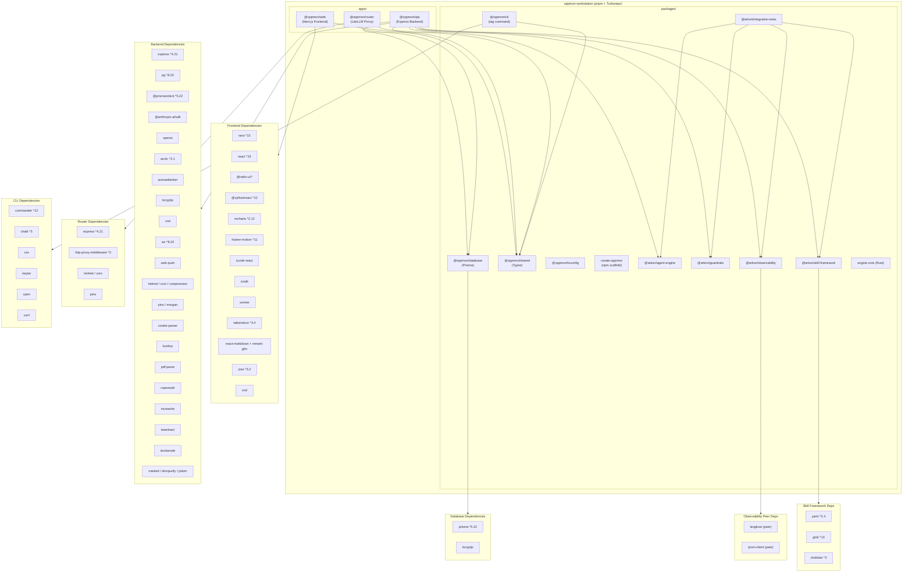

# Dependency Graph

**Last Updated:** 2026-05-11 (init sync)

## Overview

This diagram shows the major dependencies used by the OppMon (Arkon) platform across all packages in the pnpm + Turborepo monorepo. New since last init: `apps/router`, the agent/skill/safety/observability packages, document ingestion deps, and frontend markdown rendering.

## Categories

| Category | Packages |
|----------|----------|
| Web Framework | next, react, react-dom |
| API Framework | express |
| Reverse Proxy | http-proxy-middleware |
| Database | pg, prisma, @prisma/client |
| Auth | jsonwebtoken, bcryptjs, arctic, jose, cookie-parser |
| LLM | @anthropic-ai/sdk, openai (Cerebras + Ollama via REST) |
| UI | @radix-ui/*, tailwindcss, framer-motion, lucide-react |
| Markdown | react-markdown, remark-gfm, marked, dompurify, jsdom |
| Visualization | @xyflow/react, recharts |
| Real-time | ws, web-push |
| Validation | zod |
| Logging | pino, pino-pretty, morgan |
| Document Ingestion | busboy, pdf-parse, mammoth, mustache |
| Crypto | tweetnacl |
| Container Mgmt | dockerode |
| Testing | vitest, @playwright/test, supertest |
| Skill Framework | yaml, glob, chokidar |
| Observability (peer) | langfuse, prom-client |
| Build / DevTools | turbo, typescript, tsx, eslint |
