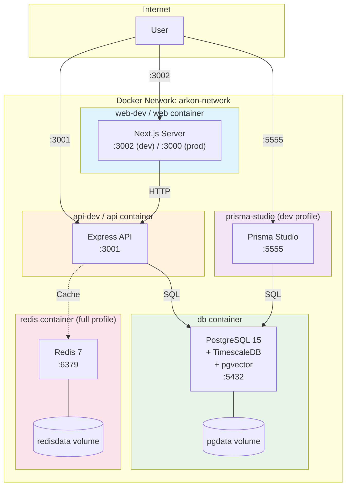
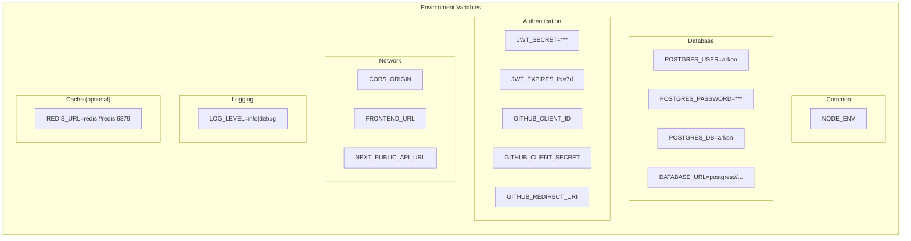
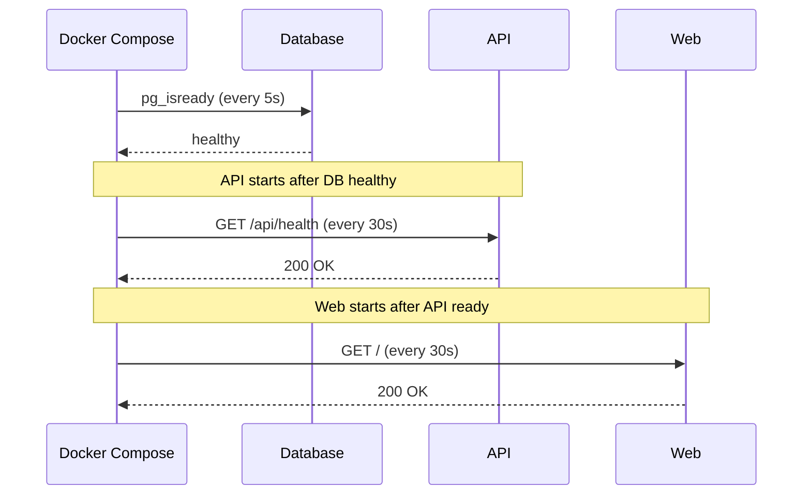

# Deployment Architecture

**Last Updated:** 2026-05-05

## Overview

This diagram shows the deployment architecture as defined in `docker-compose.yml`. The stack supports multiple profiles for development, production, and full deployment with Redis.



## Docker Compose Profiles

| Profile | Services Included | Use Case |
|---------|------------------|----------|
| (default) | db | Local development with hot reload |
| dev | db, api-dev, web-dev, prisma-studio | Containerized development |
| prod | db, api, web | Production deployment |
| full | db, api, web, redis | Production with caching |

## Service Configuration

### Database Service (db)

| Setting | Value |
|---------|-------|
| Image | `timescale/timescaledb:latest-pg15` |
| Container | `arkon-db` |
| Internal Port | 5432 |
| External Port | 5433 (configurable via `POSTGRES_PORT`) |
| Volume | `pgdata:/var/lib/postgresql/data` |
| Init Script | `scripts/init-db.sql` |
| Health Check | `pg_isready -U arkon` (every 5s) |
| Extensions | TimescaleDB, pgvector |

### API Service (api-dev / api)

| Setting | Development | Production |
|---------|-------------|------------|
| Image | Built from `apps/api/Dockerfile.dev` | Built from `apps/api/Dockerfile` |
| Container | `arkon-api-dev` | `arkon-api` |
| Port | 3001:3001 | 3001:3001 |
| Hot Reload | Yes (tsx watch) | No |
| Depends On | db (healthy) | db (healthy) |
| Health Check | `GET /api/health` (every 30s) | `GET /api/health` (every 30s) |

### Web Service (web-dev / web)

| Setting | Development | Production |
|---------|-------------|------------|
| Image | Built from `apps/web/Dockerfile.dev` | Built from `apps/web/Dockerfile` |
| Container | `arkon-web-dev` | `arkon-web` |
| Port | 3002:3002 | 3002:3000 |
| Hot Reload | Yes (next dev) | No |
| Depends On | api-dev | api |
| Health Check | `GET /` (every 30s) | `GET /` (every 30s) |

### Redis Service (full profile only)

| Setting | Value |
|---------|-------|
| Image | `redis:7-alpine` |
| Container | `arkon-redis` |
| Port | 6379:6379 |
| Volume | `redisdata:/data` |
| Health Check | `redis-cli ping` (every 5s) |

### Prisma Studio (dev profile only)

| Setting | Value |
|---------|-------|
| Image | Built from `packages/database/Dockerfile.studio` |
| Container | `arkon-prisma-studio` |
| Port | 5555:5555 |
| Depends On | db (healthy) |

## Environment Variables



## Port Mapping

| Service | Container Port | Host Port | Protocol |
|---------|---------------|-----------|----------|
| web-dev | 3002 | 3002 | HTTP |
| web | 3000 | 3002 | HTTP |
| api-dev / api | 3001 | 3001 | HTTP |
| db | 5432 | 5433 | PostgreSQL |
| redis | 6379 | 6379 | Redis |
| prisma-studio | 5555 | 5555 | HTTP |

## Volumes

| Name | Driver | Mount Point | Purpose |
|------|--------|-------------|---------|
| pgdata | local | /var/lib/postgresql/data | Persistent database storage |
| redisdata | local | /data | Redis persistence |

## Health Checks



## Development vs Production

| Aspect | Development | Production |
|--------|-------------|------------|
| Frontend | `next dev -p 3002` (hot reload) | `next build && next start` |
| Backend | `tsx watch src/index.ts` (hot reload) | `tsc && node dist/index.js` |
| Database | Local volume | Managed service (recommended) |
| Redis | Optional (full profile) | Recommended for caching |
| Secrets | `.env` file | Secret manager |
| SSL | None | Required (via reverse proxy) |
| Logging | LOG_LEVEL=debug | LOG_LEVEL=info |

## Startup Commands

```bash
# Development (local hot reload)
pnpm docker:up           # Start database only
pnpm dev                  # Start API + Web locally

# Development (containerized)
pnpm docker:up:dev        # Start all with hot reload

# Production
pnpm docker:up:prod       # Start db + api + web

# Full stack with Redis
pnpm docker:up:full       # Start all including Redis
```
