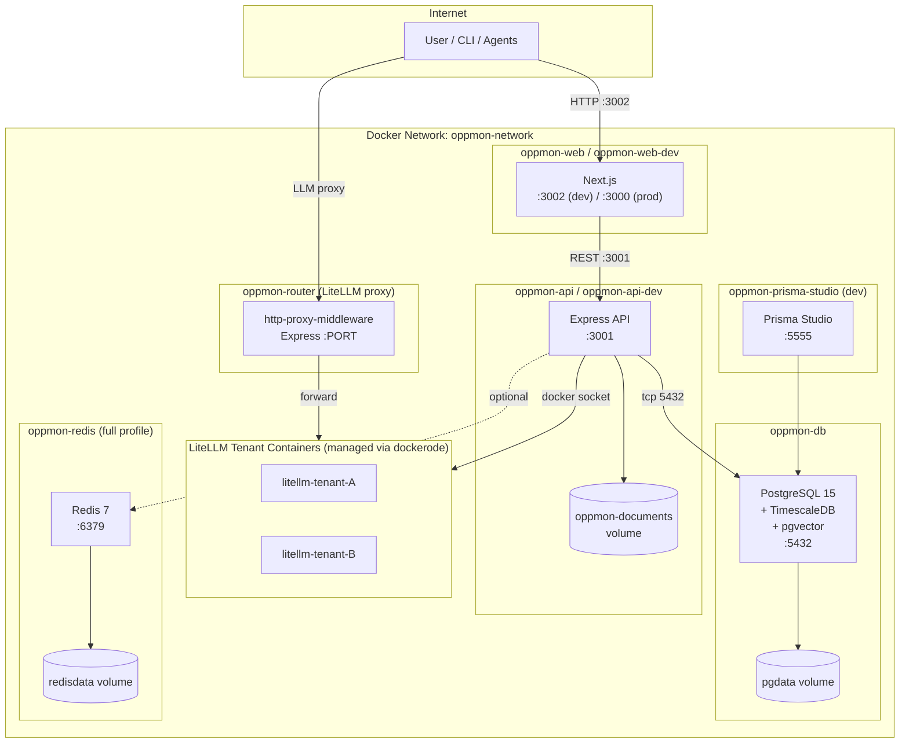

# Deployment Architecture

**Last Updated:** 2026-05-11 (init sync)

## Overview

This diagram reflects `docker-compose.yml` and the production `docker-stack.yml` for the OppMon platform. Containers are namespaced as `oppmon-*` and join the `oppmon-network` bridge. Profiles let you select db-only, dev (hot reload), prod (built images), or full (with Redis).

## Services

| Service | Container | Image / Build | Port | Profile |
|---------|-----------|---------------|------|---------|
| db | `oppmon-db` | timescale/timescaledb:latest-pg15 | 5433→5432 | always |
| redis | `oppmon-redis` | redis:7-alpine | 6379 | full |
| api-dev | `oppmon-api-dev` | apps/api/Dockerfile.dev | 3001 | dev |
| api | `oppmon-api` | apps/api/Dockerfile | 3001 | prod |
| web-dev | `oppmon-web-dev` | apps/web/Dockerfile.dev | 3002→3002 | dev |
| web | `oppmon-web` | apps/web/Dockerfile | 3002→3000 | prod |
| prisma-studio | `oppmon-prisma-studio` | packages/database/Dockerfile.studio | 5555 | dev |
| router | (defined in `docker-stack.yml` for prod) | apps/router | env-driven | prod |

## Volumes

| Volume | Purpose |
|--------|---------|
| `pgdata` | PostgreSQL data |
| `redisdata` | Redis persistence |
| `oppmon-documents` | Uploaded RAG documents (mounted by api) |

## Profiles

| Profile | Services |
|---------|----------|
| (default) | db |
| dev | db, api-dev, web-dev, prisma-studio |
| prod | db, api, web |
| full | db, api, web, redis |

## Production (docker-stack.yml)

`docker-stack.yml` defines the Swarm-mode topology for production deployments — see the `prod-swarm-deploy` skill for build/push/apply automation.

## Health Checks

- **db**: `pg_isready -U $POSTGRES_USER -d $POSTGRES_DB` (every 5s)
- **redis**: `redis-cli ping` (every 5s)
- **api / api-dev**: `wget -qO- http://localhost:3001/api/health` (every 30s)
- **web / web-dev**: `wget -qO- http://localhost:3002` (every 30s)
