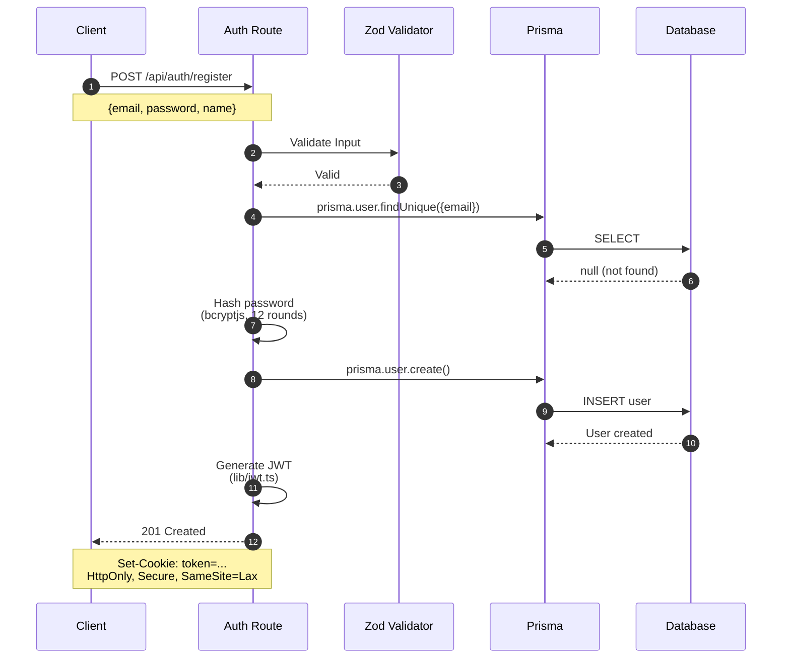
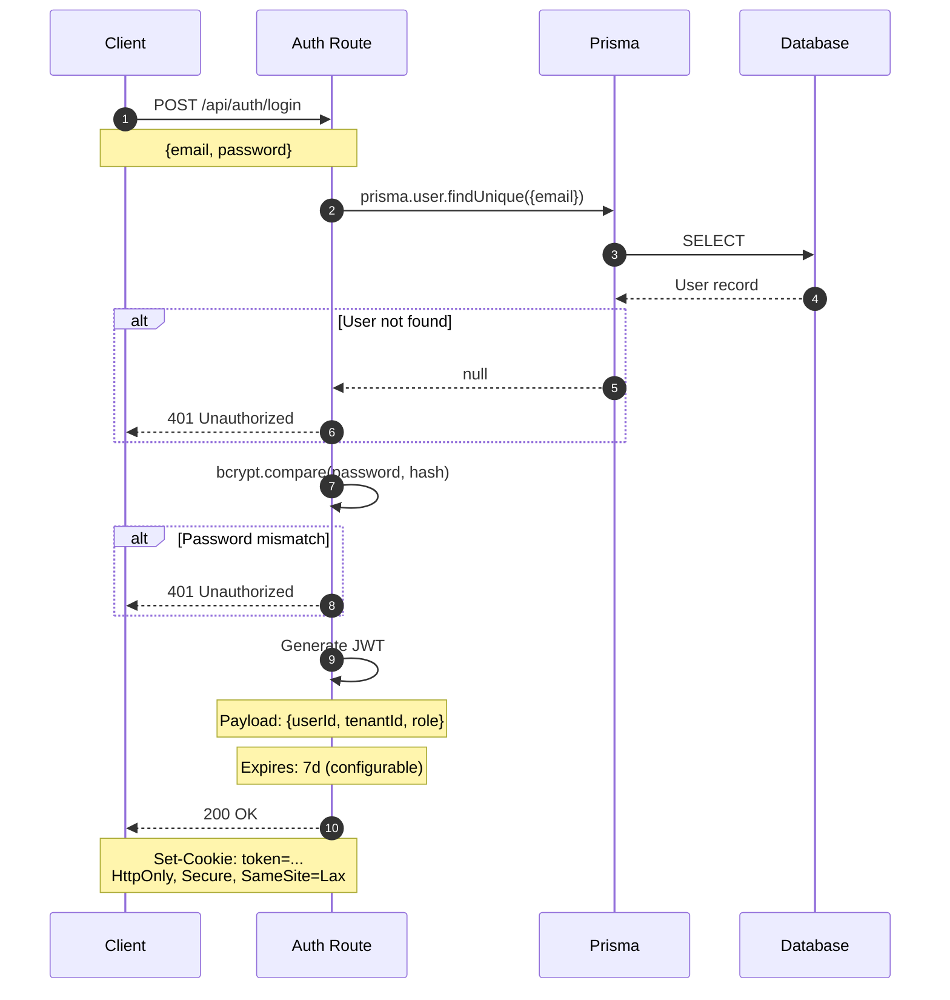
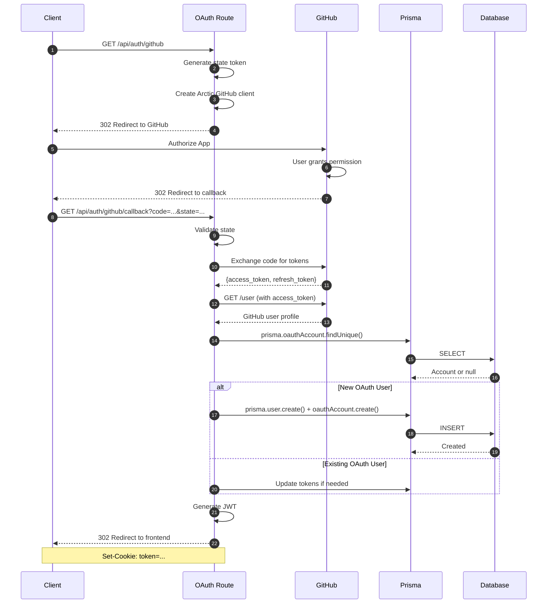
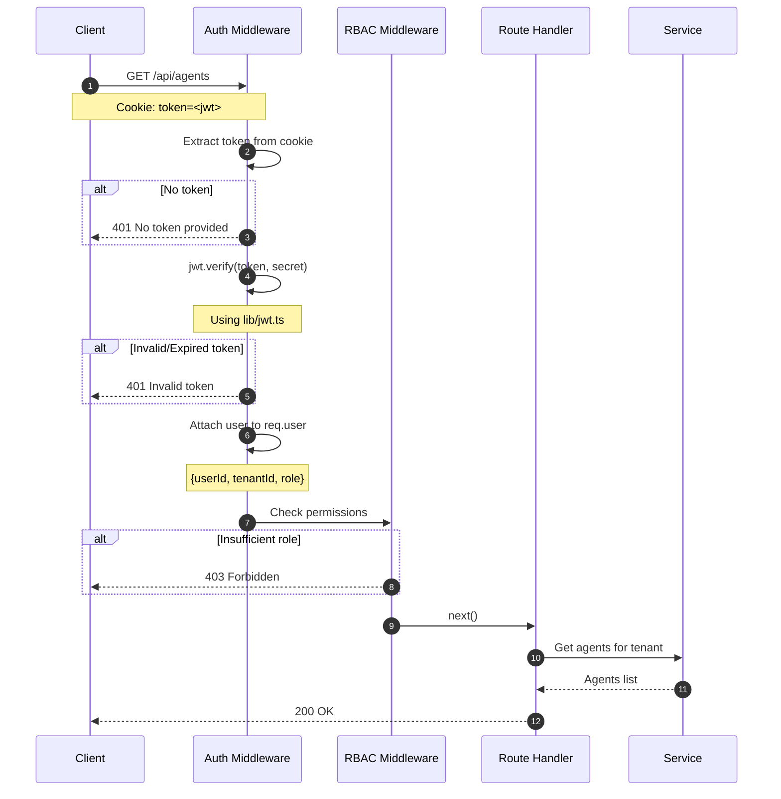
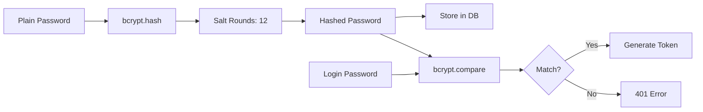
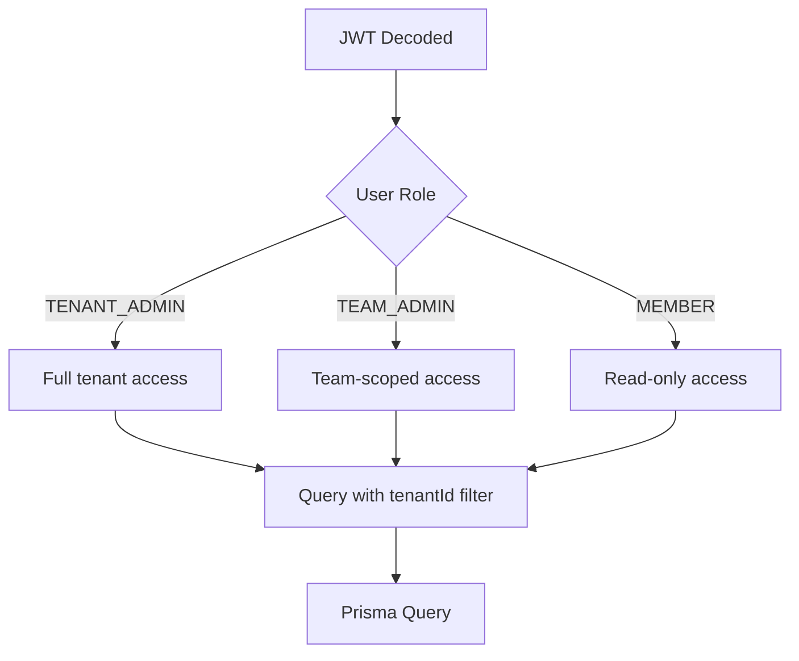

# Authentication Flow

**Last Updated:** 2026-05-07 (init sync)

## Overview

This diagram shows the authentication flows for the Arkon platform, including email/password registration, login, OAuth (GitHub), and protected route access using JWT tokens. Authentication logic is in `apps/api/src/routes/auth.ts` and `apps/api/src/routes/oauth.ts`.

## Registration Flow



## Login Flow



## GitHub OAuth Flow



## Protected Route Access



## Token Structure

### JWT Payload (JWTClaims from @arkon/shared)
```typescript
interface JWTClaims {
  userId: string;
  tenantId: string;
  email: string;
  role: 'TENANT_ADMIN' | 'TEAM_ADMIN' | 'MEMBER';
  iat: number;  // Issued at
  exp: number;  // Expiration
}
```

### Token Settings
| Setting | Value |
|---------|-------|
| Algorithm | HS256 |
| Expiration | 7 days (configurable via JWT_EXPIRES_IN) |
| Secret | `JWT_SECRET` env var |
| Storage | HttpOnly cookie |
| SameSite | Lax |
| Secure | true (in production) |

## Password Security



## Logout Flow

```mermaid
sequenceDiagram
    participant C as Client
    participant A as Auth Route

    C->>A: POST /api/auth/logout
    A->>A: Clear cookie
    A-->>C: 200 OK
    Note over C,A: Set-Cookie: token=;<br/>Max-Age=0; Path=/
```

## Multi-Tenancy Context

After authentication, every request carries tenant context:



## Session Management

| Feature | Status |
|---------|--------|
| Stateless JWT | Implemented |
| HttpOnly cookies | Implemented |
| OAuth (GitHub) | Implemented (via Arctic) |
| OAuth (Google) | Schema ready, not implemented |
| Refresh tokens | Schema ready, not implemented |
| Multi-device sessions | Schema ready (UserSession model) |
| Token blacklist | Not implemented |
