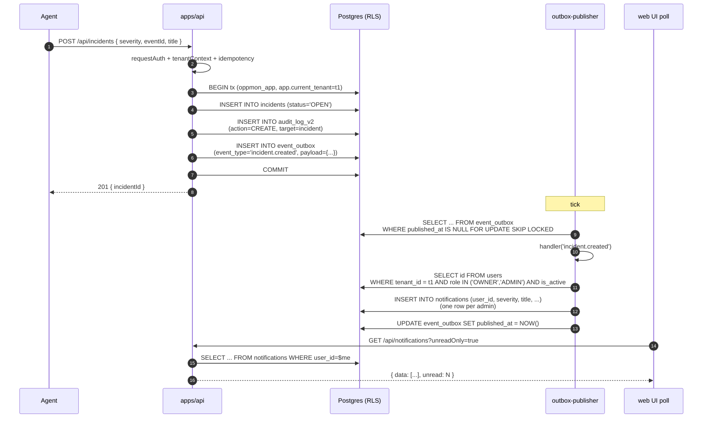

# Incident Creation — End-to-End Flow

**Last updated:** 2026-05-10

How an agent emitting a security event ends up with a tenant-wide incident, an audit trail, and notifications fanned out to every admin in the tenant.

## Plain English

1. The agent (or the threat classifier on `events`) detects a high-severity event.
2. The handler opens `withTenant()` and runs three writes atomically:
   - INSERT into `incidents` with `status='OPEN'`, severity from the event.
   - INSERT into `audit_log_v2` (`action=CREATE, target_type=incident`).
   - Enqueue `incident.created` into `event_outbox`.
3. The transaction commits. The handler returns 201 to the agent.
4. The outbox publisher picks up the row, looks up the registered handler for `incident.created`, and runs the fanout step:
   - Resolves all admins in the tenant.
   - Inserts one row per admin into `notifications` (per-user shape).
5. The web UI's notification poll picks up the new rows on its next tick.

## Sequence

## Tables touched

| Step | Table | Operation | Notes |
|---|---|---|---|
| 2a | `incidents` | INSERT | Soft-deletable; default `deleted_at IS NULL`. |
| 2b | `audit_log_v2` | INSERT | Append-only. |
| 2c | `event_outbox` | INSERT | Drained async. |
| 4a | `users` | SELECT | RLS scopes via `app.current_tenant='system'` (drainer runs as system). The query filters `WHERE tenant_id = $1` itself. |
| 4b | `notifications` | INSERT × N | Per-user fanout — one row per admin so each gets independent read state. RLS via JOIN to `users.tenant_id`. |
| 5  | `notifications` | SELECT | RLS automatically scopes to the current user via the JOIN policy. |

## Failure modes

| Failure | Consequence | Recovery |
|---|---|---|
| Tx fails before COMMIT (step 2) | Nothing written. Agent gets 5xx. | Retry with idempotency key. |
| Outbox row inserted but drainer crashes before fanout | Row stays unpublished. | Drainer picks up on next tick (SKIP LOCKED ensures other instances also try). |
| Fanout INSERT fails partway | The `INSERT INTO notifications ... VALUES (...), (...), ...` is one statement → atomic. Either all rows or none. | Drainer marks `last_error`, retries on backoff. |
| Same row drained twice (e.g. drainer crashed between handler success + outbox UPDATE) | Some users get the notification twice. | Acceptable trade-off; the plan calls for at-least-once delivery. Idempotent-handler contract documented in `apps/api/src/workers/outbox-publisher.ts`. |
