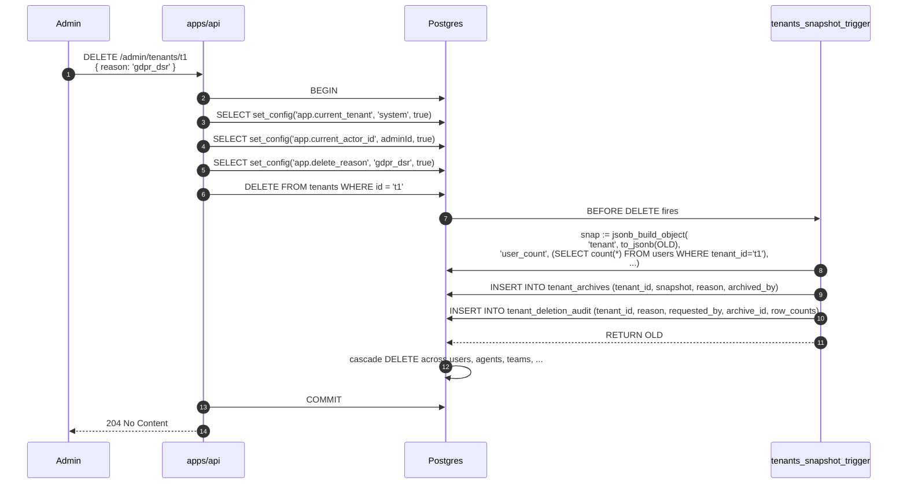

# Tenant Deletion — GDPR Flow

**Last updated:** 2026-05-10

How a tenant is hard-deleted in response to a GDPR data-subject-request, with full audit + archival.

## Plain English

1. A global admin issues `DELETE /admin/tenants/:id` with a deletion reason.
2. The API sets `app.delete_reason` and `app.current_actor_id` GUCs in the same transaction.
3. The API issues `DELETE FROM tenants WHERE id = :id`.
4. The `BEFORE DELETE` trigger `tenants_snapshot_trigger` fires:
   - Collects row counts across `users`, `agents`, `teams`, `skills`, `models`.
   - Builds a JSONB snapshot.
   - Inserts into `tenant_archives` (immutable archive).
   - Inserts into `tenant_deletion_audit` (immutable proof-of-deletion).
5. PostgreSQL cascades the delete: every FK with `ON DELETE CASCADE` to `tenants(id)` removes its rows. Soft-deletes are bypassed because we are doing a true physical delete.
6. After commit, the API returns 204.
7. The audit row in `tenant_deletion_audit` is the GDPR receipt: it records `requested_by`, `reason`, `archive_id`, and per-table `row_counts` of what was deleted.

## Sequence



## Tables touched

| Step | Table | Operation | Notes |
|---|---|---|---|
| 3 | `tenants` | DELETE | Triggers BEFORE DELETE. |
| 4a | `tenant_archives` | INSERT (via trigger) | Immutable — `REVOKE UPDATE, DELETE FROM oppmon_app`. |
| 4b | `tenant_deletion_audit` | INSERT (via trigger) | Same immutability. |
| 5 | every `ON DELETE CASCADE` child | DELETE | `users`, `agents`, `teams`, `skills`, `models`, `model_secrets`, `incidents`, `workflows`, `workflow_runs`, `notifications` (via `users` cascade), `event_outbox`, `idempotency_keys`, `embeddings`, `rag_*`, etc. |

## What's deliberately NOT in this trigger

- **Per-table row archival.** The trigger only snapshots row *counts* and the parent tenant row. Application code is expected to write per-table archives in the `tenant_archives.snapshot` JSONB before issuing the DELETE, if the deletion reason requires it. The trigger is the safety net, not the primary archival mechanism.
- **Notifying admins.** Tenant deletion is a global-admin operation; we don't fan out user notifications for it.

## Required GUCs

The trigger reads three session settings. **Set them before the DELETE** or you get sentinel values:

| GUC | Purpose | Sentinel if missing |
|---|---|---|
| `app.delete_reason` | Goes into `tenant_archives.reason` and `tenant_deletion_audit.reason`. | `'cascade_delete'` |
| `app.current_actor_id` | Goes into `archived_by` and `requested_by`. | `'unknown'` |
| `app.current_tenant` | Should be `'system'` for cross-tenant operations. | RLS will block reads inside the trigger if not set. |

## Verifying the deletion

```sql
SELECT tenant_id, reason, requested_by, archive_id, row_counts, deleted_at
  FROM tenant_deletion_audit
 WHERE tenant_id = 't1'
 ORDER BY deleted_at DESC LIMIT 1;

SELECT snapshot->>'user_count'  AS users_deleted,
       snapshot->>'agent_count' AS agents_deleted
  FROM tenant_archives
 WHERE tenant_id = 't1'
 ORDER BY archived_at DESC LIMIT 1;
```
