# Data Flow

**Last Updated:** 2026-05-07 (init sync)

## Overview

This diagram shows how data enters the OppMon (Arkon) system, gets validated, processed, stored, and returned to clients. The system supports traditional CRUD, real-time event streaming, LLM interactions (direct and via the LiteLLM router), agent oracle loops with semantic caching, document ingestion (PDF/DOCX), and semantic search via embeddings.

## Data Entry Points

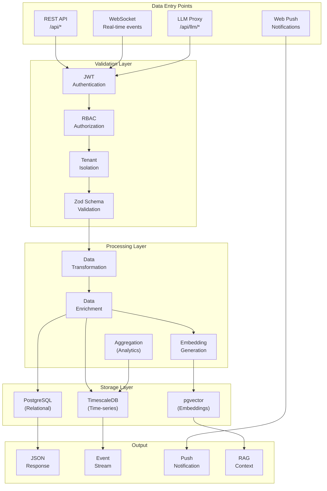

## Event Ingestion Flow

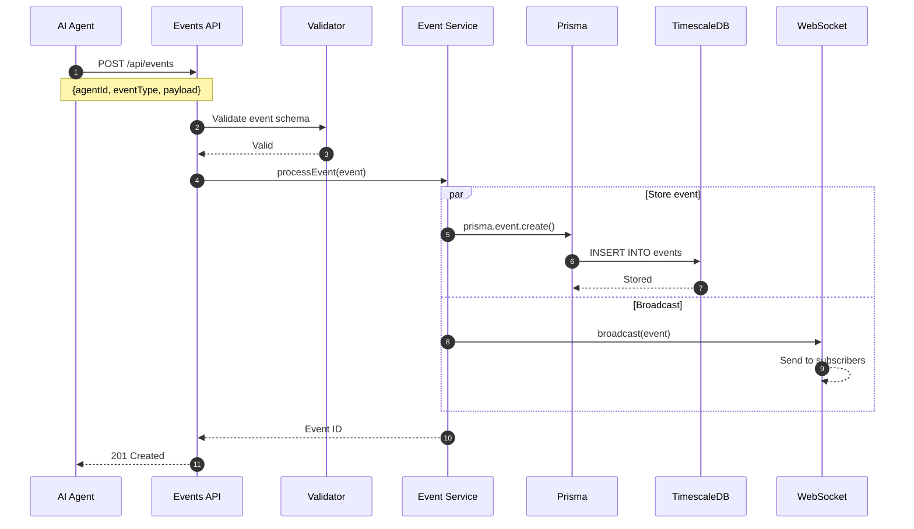

## LLM Chat Flow

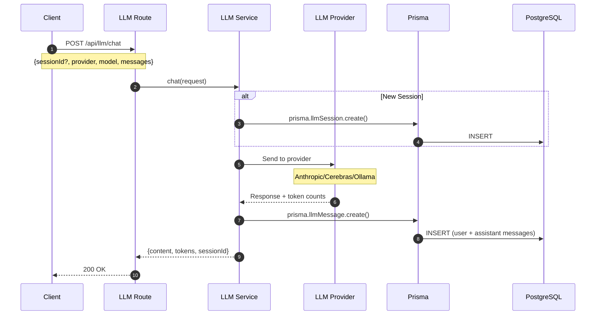

## Embedding Generation Flow

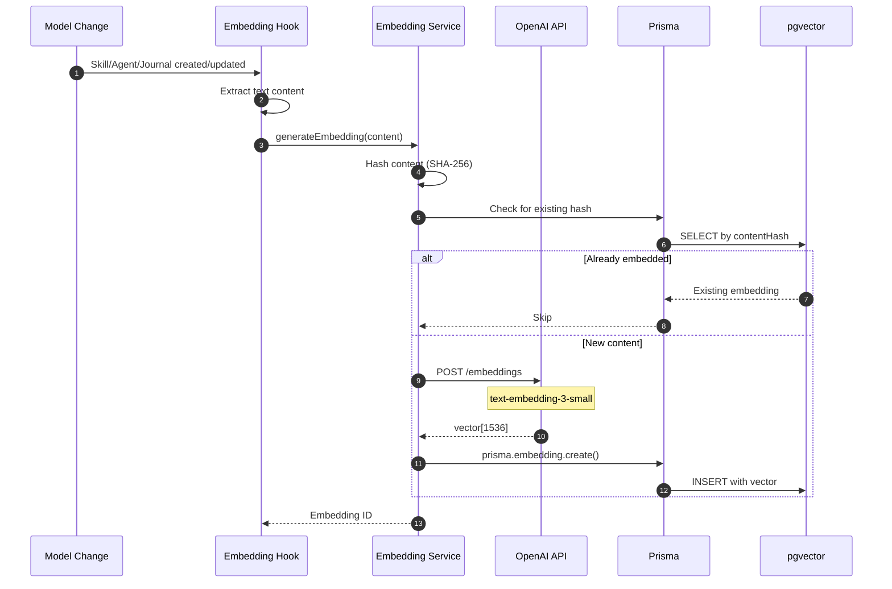

## RAG Context Retrieval Flow

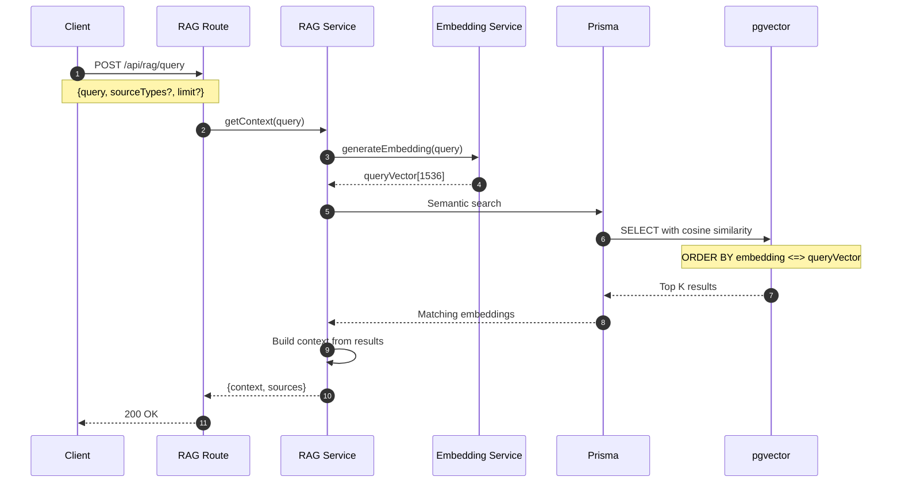

## Analytics Data Flow

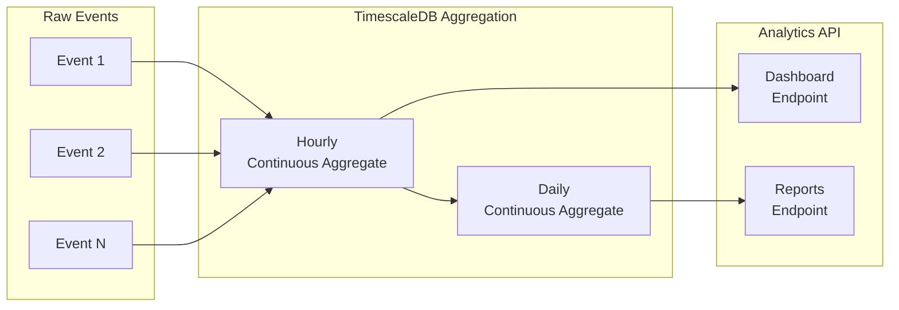

## Data Transformation Pipeline

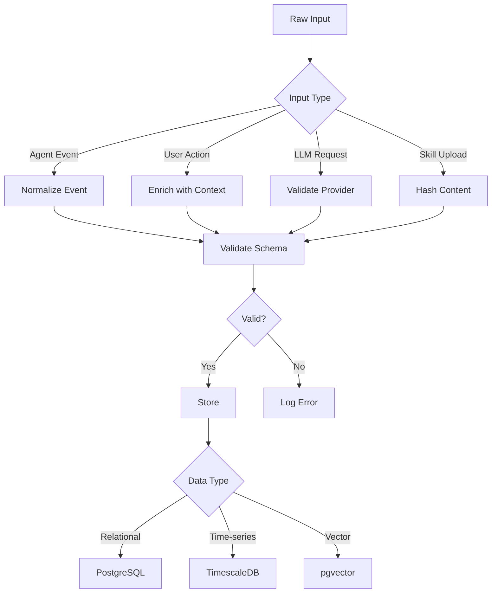

## Document Ingestion Flow (PDF / DOCX → Embeddings)

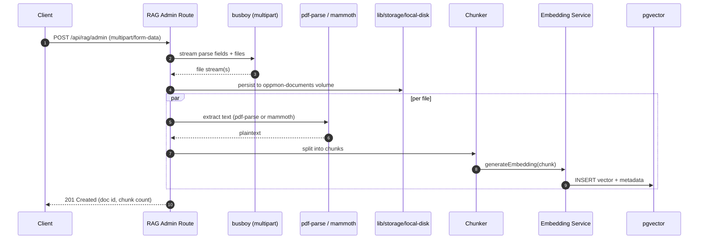

## Agent Oracle Loop Flow

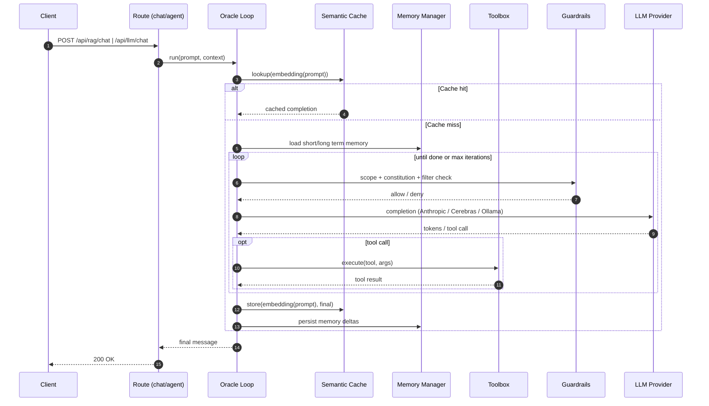

## Hybrid Search Flow (BM25 + Vector + RRF)

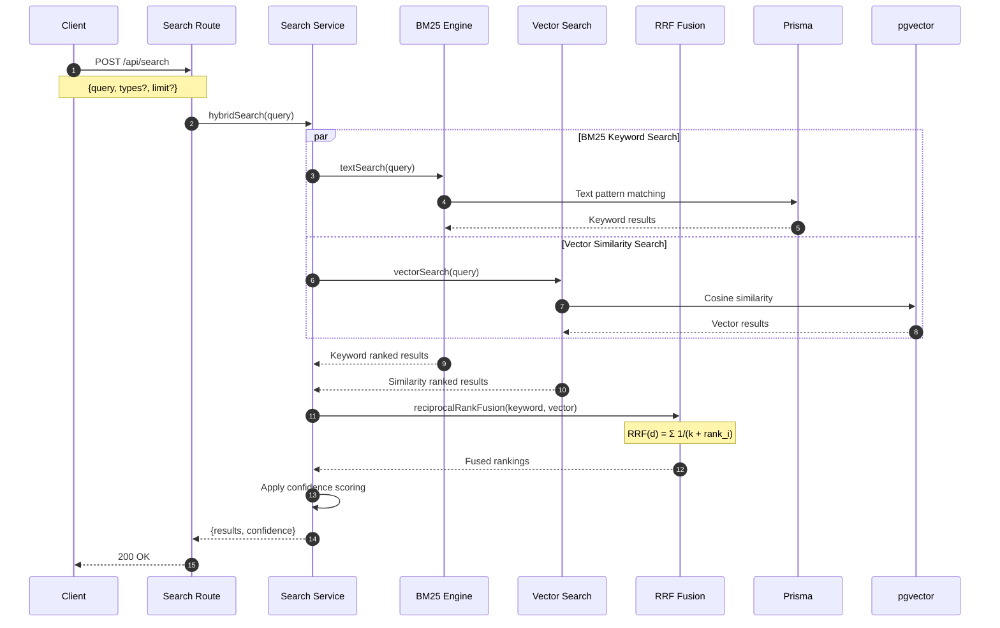

## Data Read Patterns

| Pattern | Table | Index Used | Typical Query |
|---------|-------|-----------|---------------|
| Latest events | events | (timestamp DESC) | Dashboard widget |
| Agent events | events | (agentId, timestamp) | Agent detail page |
| Event analytics | event_hourly | (bucket DESC) | Charts |
| User lookup | users | (email) | Authentication |
| Active agents | agents | (status) | Agent list |
| Tenant resources | * | (tenantId) | All queries |
| Semantic search | embeddings | HNSW (embedding) | RAG context |
| Hybrid search | embeddings + skills | BM25 + HNSW | Skill search |
| Skill lookup | skills | (tenantId, name) | Skill registry |
| LLM history | llm_messages | (sessionId, createdAt) | Chat history |
| MCP servers | mcp_servers | (tenantId, name) | MCP registry |
| Usage analytics | usage_events | (tenantId, bucketTimestamp) | Privacy-first metrics |
| Tenant settings | tenant_settings | (tenantId) | Privacy controls |

## Caching Strategy

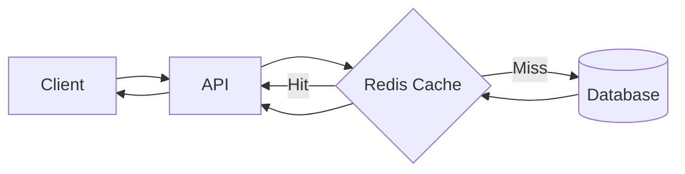

### Cache Configuration (Redis, full profile)

| Data Type | TTL | Key Pattern |
|-----------|-----|-------------|
| Dashboard aggregations | 1 min | `dashboard:{tenantId}` |
| Agent configurations | 5 min | `agent:{id}:config` |
| Skill content | 10 min | `skill:{tenantId}:{name}:{version}` |
| Embedding vectors | 1 hour | `embedding:{contentHash}` |
| User sessions | 24 hours | `session:{token}` |
