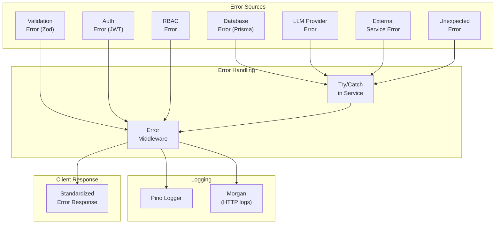
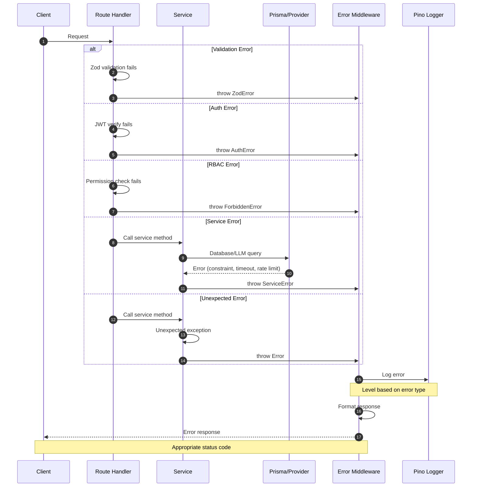
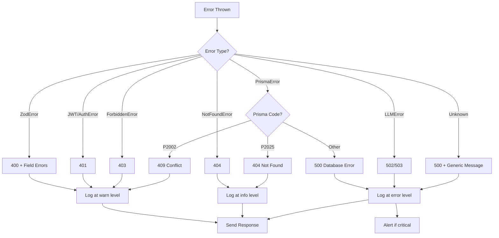
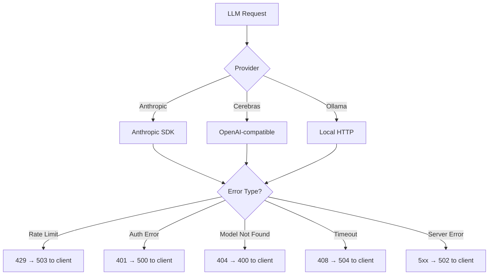
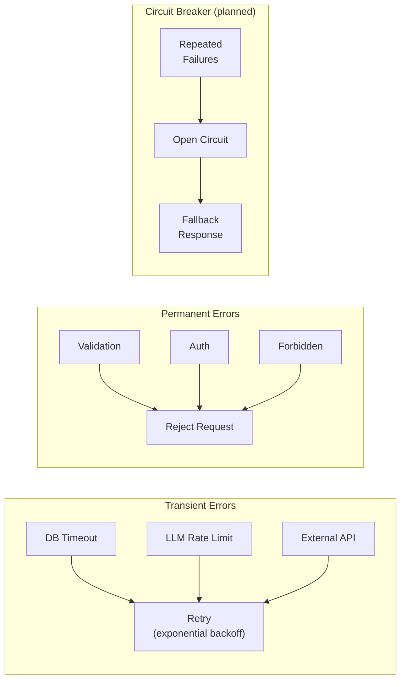

# Error Flow

**Last Updated:** 2026-05-05 (synced)

## Overview

This diagram shows how errors propagate through the Arkon system, where they're caught, how they're logged, and how they're returned to clients. Error handling is implemented in `apps/api/src/middleware/error-handler.ts`.

## Error Propagation



## Error Handling Sequence



## Error Types

| Error Type | Status Code | Logged Level | Example |
|------------|-------------|--------------|---------|
| ZodError (Validation) | 400 | warn | Invalid email format |
| AuthenticationError | 401 | warn | Invalid/expired token |
| ForbiddenError | 403 | warn | Insufficient role |
| NotFoundError | 404 | info | Agent not found |
| ConflictError | 409 | warn | Email already exists |
| RateLimitError | 429 | warn | Too many requests |
| PrismaClientKnownRequestError | 400/500 | error | Constraint violation |
| PrismaClientUnknownRequestError | 500 | error | Connection timeout |
| LLMProviderError | 502/503 | error | Anthropic rate limit |
| ExternalServiceError | 502 | error | GitHub OAuth failed |
| UnexpectedError | 500 | error | Unhandled exception |

## Error Response Format

```json
{
  "success": false,
  "error": {
    "code": "VALIDATION_ERROR",
    "message": "Invalid request body",
    "details": [
      {
        "field": "email",
        "message": "Invalid email format",
        "code": "invalid_string"
      }
    ],
    "requestId": "cuid_abc123"
  },
  "meta": {
    "timestamp": "2026-05-05T12:00:00Z"
  }
}
```

## Error Middleware Implementation



## Prisma Error Handling

| Prisma Code | Meaning | HTTP Status |
|-------------|---------|-------------|
| P2002 | Unique constraint violation | 409 Conflict |
| P2025 | Record not found | 404 Not Found |
| P2003 | Foreign key constraint violation | 400 Bad Request |
| P2014 | Required relation violation | 400 Bad Request |
| Connection errors | DB unreachable | 503 Service Unavailable |

## LLM Provider Error Handling



## Logging Configuration

### Log Levels

| Level | When Used |
|-------|-----------|
| `fatal` | App crash, unrecoverable state |
| `error` | Database errors, LLM failures, external services |
| `warn` | Validation errors, auth failures, rate limits |
| `info` | 404s, successful operations |
| `debug` | Request details (dev only, via LOG_LEVEL env) |
| `trace` | Detailed debugging (dev only) |

### Log Format (Pino)

```json
{
  "level": "error",
  "time": 1714838400000,
  "pid": 1234,
  "hostname": "arkon-api",
  "reqId": "cuid_abc123",
  "err": {
    "type": "PrismaClientKnownRequestError",
    "code": "P2002",
    "message": "Unique constraint failed on the fields: (`email`)",
    "stack": "..."
  },
  "req": {
    "method": "POST",
    "url": "/api/auth/register",
    "userAgent": "..."
  },
  "tenantId": "tenant_xyz"
}
```

## Error Recovery Strategies



## Future Improvements

- [ ] Implement circuit breaker for LLM providers
- [ ] Add retry logic with exponential backoff for transient errors
- [ ] Set up error alerting integration (Sentry, PagerDuty)
- [ ] Add distributed tracing (OpenTelemetry)
- [ ] Implement structured error codes registry
- [ ] Add error rate monitoring and dashboards
