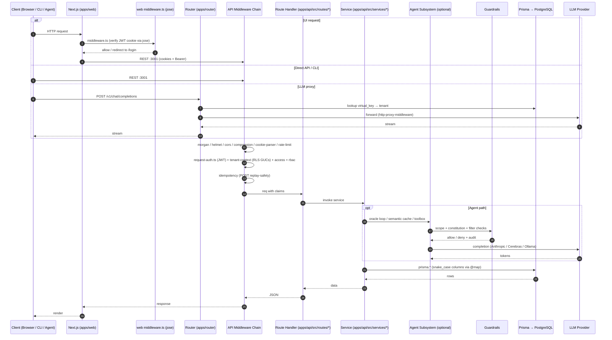

# Request Flow

**Last Updated:** 2026-05-11 (init sync)

## Overview

This diagram shows the complete lifecycle of an API request from the client through Next.js (with `middleware.ts` using `jose`) into the Express backend at `apps/api/`. LLM-bound traffic from CLIs and SDKs may bypass `apps/web` and hit `apps/router/` (LiteLLM proxy) directly.

## Middleware Chain

1. `morgan` — HTTP access log
2. `helmet` — security headers
3. `cors` — cross-origin
4. `compression` — gzip
5. `cookie-parser` — parse cookies
6. `request-auth.ts` — JWT verification (skips public paths)
7. `tenant-context.ts` — sets Postgres GUCs (`app.tenant_id`, `app.current_actor_id`) so RLS policies apply
8. `access.ts` — scope / policy evaluation
9. `rbac.ts` — role check
10. `idempotency.ts` — replay-safe POSTs via Idempotency-Key
11. `rate-limiter.ts` — per-route limits
12. Route handler → service → Prisma → response
13. `error-handler.ts` — last-resort error formatter

## Notes

- The frontend's `middleware.ts` uses `jose` to verify the JWT at the edge before rendering protected pages.
- The router (`apps/router`) is a separate Express service for LLM traffic — it does not run the full middleware chain because the API still owns auth/audit for non-LLM endpoints.
