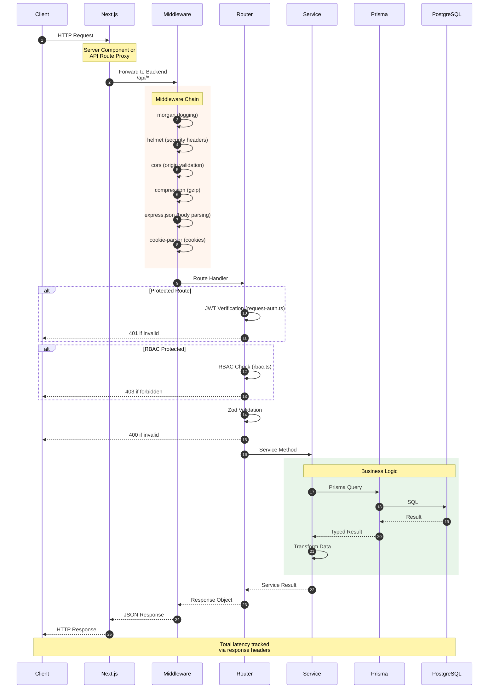
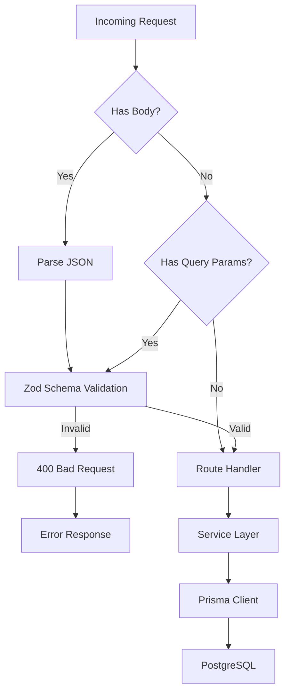

# Request Flow

**Last Updated:** 2026-05-05

## Overview

This diagram shows the complete lifecycle of an API request from the client through the Express backend to the database and back. The backend is located at `apps/api/`.



## Middleware Stack

The Express app applies middleware in this order (defined in `apps/api/src/index.ts`):

| Order | Middleware | File | Purpose |
|-------|------------|------|---------|
| 1 | `morgan` | (built-in) | HTTP request logging |
| 2 | `helmet` | (built-in) | Security headers (CSP, HSTS, etc.) |
| 3 | `cors` | (built-in) | Cross-origin request handling |
| 4 | `compression` | (built-in) | Gzip response compression |
| 5 | `express.json` | (built-in) | JSON body parsing |
| 6 | `cookie-parser` | (built-in) | Cookie parsing |
| 7 | `requestAuth` | `middleware/request-auth.ts` | JWT verification (on protected routes) |
| 8 | `rbac` | `middleware/rbac.ts` | Role-based access control |
| 9 | `rateLimiter` | `middleware/rate-limiter.ts` | Rate limiting |
| 10 | `errorHandler` | `middleware/error-handler.ts` | Standardized error responses |

## Request Validation



## Response Format

### Success Response
```json
{
  "success": true,
  "data": { /* payload */ },
  "meta": {
    "timestamp": "2026-05-05T12:00:00Z",
    "requestId": "cuid_abc123"
  }
}
```

### Error Response
```json
{
  "success": false,
  "error": {
    "code": "VALIDATION_ERROR",
    "message": "Invalid input",
    "details": [
      { "field": "email", "message": "Invalid email format" }
    ]
  },
  "meta": {
    "timestamp": "2026-05-05T12:00:00Z",
    "requestId": "cuid_abc123"
  }
}
```

## Key Routes (apps/api/src/routes/)

| Method | Path | File | Description |
|--------|------|------|-------------|
| GET | /api/health | `health.ts` | Health check (liveness/readiness) |
| POST | /api/auth/login | `auth.ts` | User authentication |
| POST | /api/auth/register | `auth.ts` | User registration |
| GET | /api/auth/github | `oauth.ts` | GitHub OAuth initiate |
| GET | /api/auth/github/callback | `oauth.ts` | GitHub OAuth callback |
| GET | /api/agents | `agents.ts` | List agents |
| POST | /api/events | `events.ts` | Ingest event |
| GET | /api/dashboard | `dashboard.ts` | Dashboard metrics |
| GET | /api/workflows | `workflows.ts` | List workflows |
| GET | /api/incidents | `incidents.ts` | List incidents |
| GET | /api/analytics | `analytics.ts` | Usage analytics |
| GET | /api/costs | `costs.ts` | Cost tracking |
| GET | /api/security | `security.ts` | Security overview |
| GET | /api/compliance | `compliance.ts` | Compliance data |
| POST | /api/gateway/* | `gateway.ts` | AI Gateway proxy |
| GET | /api/notifications | `notifications.ts` | User notifications |
| GET | /api/infra | `infra.ts` | Infrastructure nodes |
| GET | /api/journal | `journal.ts` | Agent journals |
| GET/POST | /api/skills | `skills.ts` | Skills registry |
| POST | /api/llm/chat | `llm.ts` | LLM chat completion |
| POST | /api/rag/query | `rag.ts` | RAG context retrieval |
| POST | /api/embedding | `embedding.ts` | Generate embeddings |
