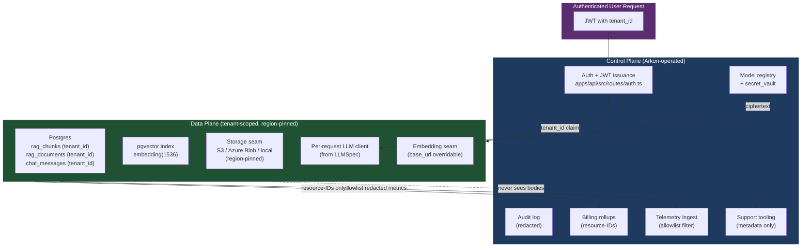

# Control Plane vs Data Plane

**Last Updated:** 2026-05-14

A regulated-sector buyer's first question is "who at Arkon can see my
content?" The answer is: nobody at Arkon sees customer content via
production tooling, because the control plane and data plane are split.

## Responsibility table

| Concern | Control Plane | Data Plane |
|---------|---------------|------------|
| Tenant + user records | ✅ stores | ❌ never |
| Model registry + secret_vault | ✅ stores (encrypted at rest) | reads ciphertext only, decrypts per-request, never logs |
| Audit log | ✅ stores (redacted bodies) | ❌ never |
| Billing + usage rollups | ✅ stores (resource-IDs only) | ❌ never |
| RAG documents + chunks | ❌ never reads body | ✅ stores, region-pinned |
| RAG embeddings | ❌ never | ✅ stores (vector(1536)) |
| Uploaded files | ❌ never | ✅ stores via Storage seam |
| Chat messages | ❌ never reads body | ✅ stores tenant-scoped |
| Per-request LLM client | ❌ never instantiates | ✅ instantiates from LLMSpec, dies at request end |
| Telemetry (logs / metrics / traces) | ✅ ingests, **allowlist-redacted** (TAG-84) | emits only allowlist fields |
| Support tooling | ✅ can read metadata | ❌ cannot read content |

The line is: **bodies stay in the data plane; metadata bubbles up to the
control plane through an allowlist.**

## Component diagram

## Practical implications

1. **A support engineer cannot read a customer's chat history.** The support
   tooling queries control-plane tables. Chat bodies aren't there.
2. **Telemetry ingestion is the only legitimate "uphill" path from data
   plane to control plane.** TAG-84 makes the allowlist enforced by lint,
   not by hope.
3. **The secret_vault stores ciphertext.** Decryption happens inside the
   per-request LLM client and the plaintext never crosses the await
   boundary. (This invariant is locked in by TAG-54 round-trip tests and
   re-asserted by the BYO-VPC bundle in TAG-85.)
4. **In BYO-VPC mode, the entire data plane lives in the customer's VPC.**
   The control plane shrinks to whatever telemetry collector the customer
   stands up (which may be nothing in air-gap mode).

## Related

- [architecture.md](./architecture.md)
- [topology.md](./topology.md) — how this split shifts across SaaS / single-tenant / BYO-VPC
- [cross-tenant-isolation-flow.md](./cross-tenant-isolation-flow.md)
- [ADR-0012](../decisions/ADR-0012-residency-model.md)
