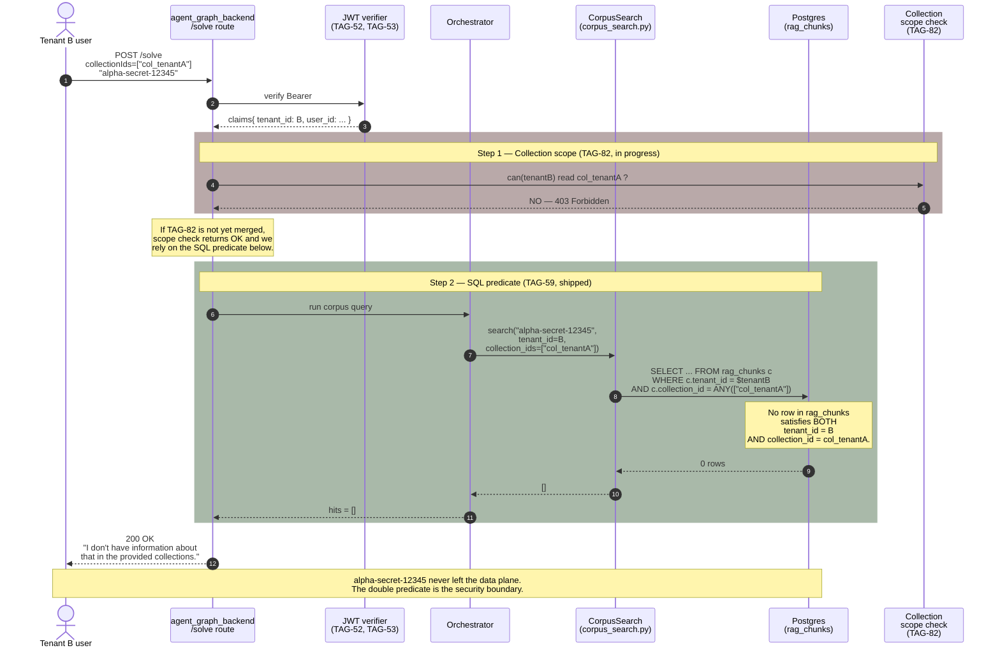

# Cross-Tenant Isolation — Denial at the SQL Layer

**Last Updated:** 2026-05-14

This diagram mirrors the **mandatory cross-tenant negative test** from
[TAG-59](../jira/TAG-59-corpus-search.md) (and the parity test from
[TAG-81](../jira/TAG-81-ts-rag-cross-tenant-audit.md) on the TypeScript
side).

## The scenario

Tenant A has a private collection containing the literal phrase
`alpha-secret-12345`. Tenant B holds a valid JWT and, somehow, also knows
Tenant A's `collection_id` (say, leaked in a URL or guessed). Tenant B
issues a `/solve` request scoped to that collection_id.

We need the result to be: **empty, denied at the SQL predicate, no rows
crossed tenant boundary.** Not 200 with redacted content. Not "soft" rate
limit. The chunk never leaves the database.

## Sequence



## Why two checks (TAG-82 + TAG-59) and not just one?

Defense in depth.

- **TAG-82 (scope check)** turns the request into a 403 — the user gets a
  clear, audit-logged refusal at the route layer. This is the
  user-experience-correct behavior and the part that prevents enumeration
  ("I got 200 with empty → that collection exists" vs "I got 403 → I can't
  tell").
- **TAG-59 (SQL predicate)** is the part that holds even if TAG-82 is
  bypassed by a future bug, by an internal caller that skips the route
  layer, or by an admin tool that issues a raw query. The predicate is
  redundant with TAG-82 on purpose. The CI negative test fails the build
  if it's ever dropped.

This is the same "two locks on different layers" pattern as Pillar 1
(`tenant_id` on both `rag_chunks` and `rag_documents`).

## The exact SQL shape

From `apps/agent_graph_backend/agent_search/agent_v2/rag/corpus_search.py`
(TAG-59):

```sql
-- BM25 (the vector path uses the identical predicate)
SELECT
  c.id, c.doc_id, c.collection_id, c.text, c.metadata
FROM rag_chunks c
WHERE c.tenant_id = $1::text             -- <-- the security boundary
  AND c.collection_id = ANY($2::text[])  -- <-- the scope boundary
  AND c.tsv @@ plainto_tsquery('english', $3)
ORDER BY ts_rank_cd(c.tsv, plainto_tsquery('english', $3)) DESC
LIMIT $4;
```

Both predicates use parameterized arguments (never string-interpolated user
input). The `$1` is taken from the verified JWT's `tenant_id` claim, never
from the request body.

## The CI test that locks this in

From TAG-59's Tests table:

```python
# tests/rag/test_corpus_search.py
async def test_tenant_b_cannot_retrieve_tenant_a_chunk(seed_two_tenants_with_corpora):
    # Tenant A seeded with a chunk containing "alpha-secret-12345".
    # Tenant B requests that exact string, targeting A's collection_id.
    hits = await corpus.search(
        "alpha-secret-12345",
        tenant_id=b_user.tenant_id,
        collection_ids=[a_collection.id],
    )
    assert hits == []
```

If a future PR drops the `tenant_id` predicate from `BM25_SQL` or `VEC_SQL`,
this test fails and the build is blocked. That is the durable enforcement
mechanism — the diagram above is the explanation, the test is the contract.

[TAG-81](../jira/TAG-81-ts-rag-cross-tenant-audit.md) ships the parity test
for the TypeScript surface (`apps/api/src/services/rag.ts`). When TAG-81
merges, this document's "rect" annotations apply to both stacks.

## Related

- [TAG-59](../jira/TAG-59-corpus-search.md) — Python implementation + test
- [TAG-81](../jira/TAG-81-ts-rag-cross-tenant-audit.md) — TS parity story
- [TAG-82](../jira/TAG-82-collection-scope-enforcement.md) — route-layer 403
- [architecture.md](./architecture.md) — full pillar list
- [ADR-0012](../decisions/ADR-0012-residency-model.md) — the locking decision
