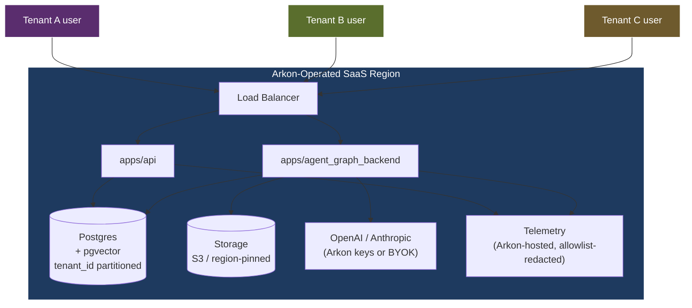
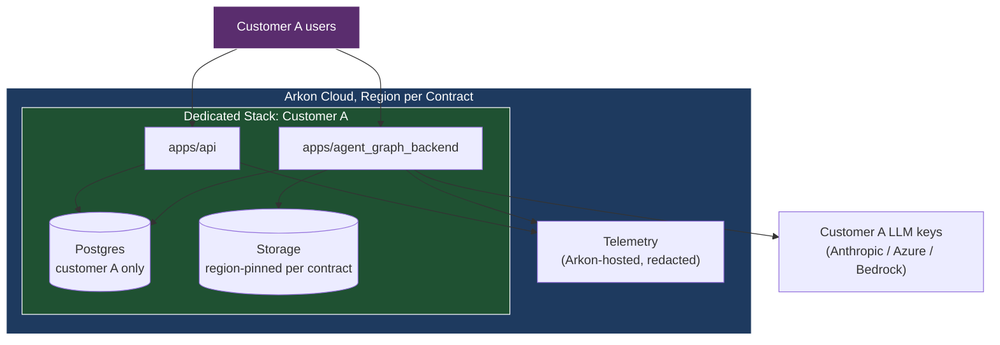
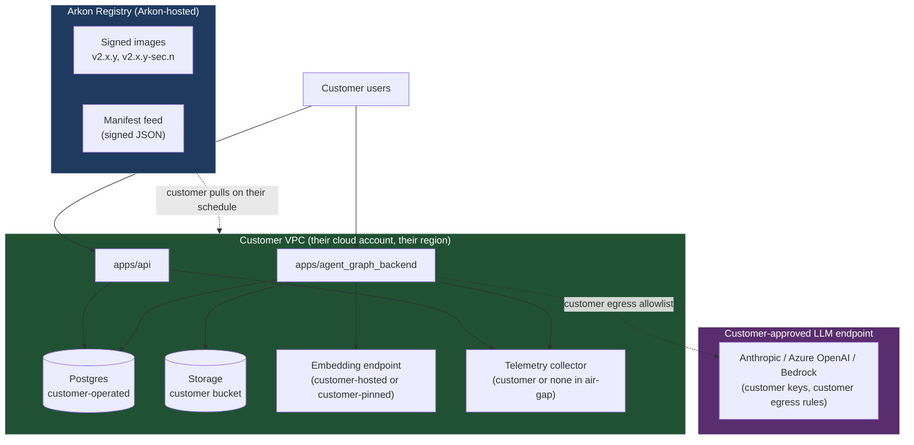

# Deployment Topologies

**Last Updated:** 2026-05-14

OppMon (Arkon) ships **one codebase, three topologies**. The topology a
customer gets is a config bundle decision — not a code fork. See
[ADR-0012](../decisions/ADR-0012-residency-model.md) for why.

| Topology | DB owner | Storage owner | LLM owner | Telemetry | Upgrade channel |
|----------|----------|---------------|-----------|-----------|-----------------|
| **SaaS (default)** | Arkon | Arkon (region-pinned) | Arkon-keyed OR customer-keyed | Arkon hosted, allowlist-redacted | Arkon controls |
| **Single-tenant managed** | Arkon (dedicated cluster) | Arkon (region-pinned per contract) | Customer-keyed only | Arkon hosted, allowlist-redacted | Arkon controls (with customer maintenance window) |
| **BYO-VPC** | Customer | Customer | Customer-keyed only | Customer hosted (or none in air-gap) | Customer pulls per [ADR-0013](../decisions/ADR-0013-byo-vpc-upgrade-channel.md) |

---

## SaaS (default)

The shared multi-tenant deployment Arkon operates. Tenant isolation is
enforced by `tenant_id` predicates at the SQL layer (the cross-tenant test
from TAG-59 is the contract).

**Who can see what:** Arkon SRE can read metadata (tenant ID, model
selection, request counts). Arkon SRE cannot read chat bodies, document
contents, or chunk text — those fields are not in the redaction allowlist
(TAG-84).

---

## Single-tenant managed

Dedicated stack per customer, still inside Arkon's cloud account, but with
its own Postgres cluster, its own storage bucket pinned to the contracted
region, and customer-keyed LLM providers only.

**Who can see what:** Same as SaaS, but the storage region is contractually
fixed and the LLM provider keys are the customer's. Arkon never holds the
LLM keys. Compute is still in Arkon's cloud account.

---

## BYO-VPC

Customer runs our images in their cloud account. Arkon publishes images +
manifest; customer pulls per ADR-0013. Optional air-gap mode forbids all
outbound except the customer-pinned LLM endpoint.

**Who can see what:** Arkon sees nothing about the customer's runtime. The
manifest feed is read-only and outbound from Arkon. The customer's
telemetry collector (if any) is theirs. In air-gap mode the only outbound
is the customer-pinned LLM endpoint.

**Upgrades:** governed by [ADR-0013](../decisions/ADR-0013-byo-vpc-upgrade-channel.md).
`tag deploy byo-vpc` renders the bundle (TAG-85).

---

## Why one codebase

[ADR-0012](../decisions/ADR-0012-residency-model.md) commits us to a single
codebase across all three topologies. The seams (storage / embedding / LLM)
let topology be a config decision, not a fork.

The Three Pillars from the residency architecture map cleanly:

| Pillar | SaaS | Single-tenant | BYO-VPC |
|--------|------|---------------|---------|
| tenant_id SQL predicate | ✅ shared cluster | ✅ even though only one tenant | ✅ (paranoia + parity) |
| Pluggable seams | ✅ but Arkon-configured | ✅ region-pinned per contract | ✅ customer-configured |
| Per-request LLM client | ✅ | ✅ | ✅ |

## Related

- [ADR-0012](../decisions/ADR-0012-residency-model.md)
- [ADR-0013](../decisions/ADR-0013-byo-vpc-upgrade-channel.md)
- [architecture.md](./architecture.md)
- [control-plane-vs-data-plane.md](./control-plane-vs-data-plane.md)
- [TAG-85: BYO-VPC Deployment Package](../jira/TAG-85-byo-vpc-deployment-package.md)
