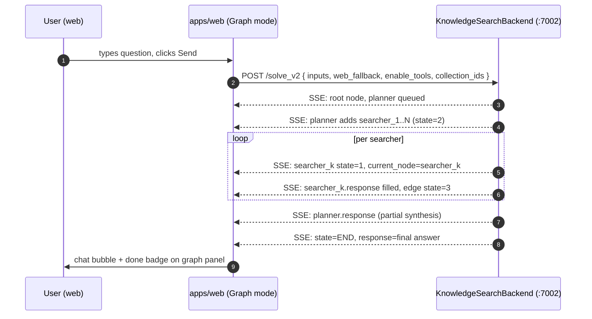

# `/solve_v2` — Graph-mode Agent Endpoint

**Last updated:** 2026-05-12

Reference for the SSE endpoint that powers OppMon Chat's **Graph mode** and
the eval harness's graph runs.

> **Important:** `/solve_v2` is **not** served by this monorepo. It lives in a
> separate Python service (`KnowledgeSearchBackend` / mindsearch) whose source
> is in `D:\my_files\workstation_new\gmatches-website\KnowledgeSearchBackend`.
> The deployed instance runs on the LAN at **192.168.1.195:8002**. This Node
> workstation only *consumes* it via a server-side proxy. Anything in
> `apps/api` continues to serve the simple-mode endpoint
> `/api/rag/chat/stream`.

## Architecture

```
Browser  ──POST /api/graph/solve──▶  apps/web (Next.js proxy)  ──▶  mindsearch backend
                  ▲                       │                          POST /solve_v2 (SSE)
                  └──────── SSE ──────────┘                          existing service at
                       pipes ReadableStream straight through         192.168.1.195:8002
```

- The browser **never** talks to KnowledgeSearchBackend directly. It hits the
  same-origin Next.js route handler at `apps/web/src/app/api/graph/solve/route.ts`,
  which forwards to `GRAPH_BACKEND_URL` server-side.
- The proxy injects an optional `Authorization: Bearer ${GRAPH_BACKEND_TOKEN}`,
  hides the backend URL from the browser bundle, and pipes the SSE stream
  unmodified so latency stays low.
- A build-time flag (`NEXT_PUBLIC_GRAPH_ENABLED`) hides the Graph toggle in
  environments where the backend isn't deployed — users never see a button
  that errors on click.
- The eval harness still calls `/solve_v2` **directly** (server-to-server,
  see `ARKON_GRAPH_URL`) because it runs in Node and doesn't need the
  same-origin/auth guarantees of the browser proxy.

---

## What it is

A long-running HTTP POST that streams Server-Sent Events. Each event carries
the **full current state of a planner → searcher graph**, plus a pointer to
the currently active node. The client redraws the graph on every event, so the
user watches the agent decompose a question, dispatch sub-searches, and
synthesize an answer in real time.

Compared to simple mode (`/api/rag/chat/stream`), graph mode answers are
3–5x more expensive (planner + N sub-searchers per question) and noticeably
slower, but they expose the agent's reasoning so users can audit and trust it.

---

## Where it's wired up

| Consumer | File | Purpose |
|---|---|---|
| Web chat | [`apps/web/src/app/(dashboard)/chat/page.tsx`](../apps/web/src/app/(dashboard)/chat/page.tsx) | Graph toggle (gated on `NEXT_PUBLIC_GRAPH_ENABLED`), SSE consumer, resizable right-side panel |
| Web SSE proxy | [`apps/web/src/app/api/graph/solve/route.ts`](../apps/web/src/app/api/graph/solve/route.ts) | Same-origin Next.js route that forwards to `GRAPH_BACKEND_URL` |
| Graph renderer | [`apps/web/src/components/AgentGraphPanel.tsx`](../apps/web/src/components/AgentGraphPanel.tsx) | xyflow-based DAG visualisation |
| Eval client | [`evals/scripts/lib/arkon-client.ts`](../evals/scripts/lib/arkon-client.ts) (`askGraph`) | Captures full graph + final answer for scoring (server-to-server, no proxy) |
| Eval runner | [`evals/scripts/run.ts`](../evals/scripts/run.ts) | Drives graph mode for every question in `questions.json` |
| Dev stack | [`docker-compose.yml`](../docker-compose.yml) (`graph-agent`, `--profile graph`) | Opt-in container for the KnowledgeSearchBackend image |
| Prod stack | [`docker-stack.yml`](../docker-stack.yml) (commented `graph-agent` block) | Template for deploying the backend to Swarm |

---

## Configuration

| Side | Variable | Scope | Default | Purpose |
|---|---|---|---|---|
| Web | `GRAPH_BACKEND_URL` | server-only (runtime) | *(unset)* | Where the proxy forwards. Set to `http://192.168.1.195:8002` to use the existing backend. Unset = proxy returns 503. |
| Web | `GRAPH_BACKEND_TOKEN` | server-only (runtime) | *(unset)* | Optional bearer token injected as `Authorization` header upstream. |
| Web | `NEXT_PUBLIC_GRAPH_ENABLED` | **build-time** | `false` | Renders the Graph toggle. Must be `"true"` (string). |
| Web | `NEXT_PUBLIC_GRAPH_AGENT_URL` | build-time | `/api/graph/solve` | Escape hatch — override only when intentionally bypassing the proxy. |
| Evals | `ARKON_GRAPH_URL` | runtime | `http://192.168.1.195:8002/solve_v2` | Direct backend URL — evals don't go through the web proxy. |
| Docker (offline only) | `GRAPH_AGENT_IMAGE` | runtime | `knowledge-search-backend:placeholder` | Image used by the optional `--profile graph` local container. |

> `NEXT_PUBLIC_*` are baked in at `pnpm build` / `docker build` time. Flipping
> them requires a rebuild of the web image.

---

## Rollout checklist

When you're ready to enable Graph mode in an environment:

1. **Deploy the backend.** Get `KnowledgeSearchBackend` running and reachable.
   For local dev:
   ```bash
   export GRAPH_AGENT_IMAGE=thachrocky/knowledge-search:latest   # or your tag
   export GRAPH_BACKEND_URL=http://graph-agent:7002              # service name
   export NEXT_PUBLIC_GRAPH_ENABLED=true
   docker compose --profile dev --profile graph up
   ```
2. **Smoke-test the proxy** from inside the web container or a same-origin
   browser:
   ```bash
   curl -N -X POST http://localhost:3002/api/graph/solve \
        -H 'Content-Type: application/json' \
        -d '{"inputs":"hello","web_fallback":false,"enable_tools":false,"collection_ids":[]}'
   ```
   Expect a stream of `data: {...}` lines. A `503 graph_backend_not_configured`
   means `GRAPH_BACKEND_URL` didn't reach the Next.js process — check that the
   var is set on the web service, not just in your shell.
3. **Verify the toggle renders** at `/chat`. If it's hidden, the web image
   was built without `NEXT_PUBLIC_GRAPH_ENABLED=true` — rebuild and redeploy
   the web service.
4. **Prod (Swarm):** uncomment the `graph-agent` block in `docker-stack.yml`,
   set `services.web.environment.GRAPH_BACKEND_URL=http://graph-agent:7002`,
   and rebuild `thachrocky/oppmon-web` with
   `--build-arg NEXT_PUBLIC_GRAPH_ENABLED=true`.

---

## Request

The browser hits `/api/graph/solve`; the proxy forwards the same JSON body to
`${GRAPH_BACKEND_URL}/solve_v2`.

```
POST /api/graph/solve           (browser → web)
POST /solve_v2                  (web → KnowledgeSearchBackend)
Content-Type: application/json

{
  "inputs":         "Compare CRISPR-Cas9 and CRISPR-Cas12 …",
  "web_fallback":   true,
  "enable_tools":   false,
  "collection_ids": []
}
```

### Proxy-specific responses

| Status | Body | Meaning |
|---|---|---|
| `200` | `text/event-stream` | Upstream connected; events stream through. |
| `400` | `{ error: { code: "invalid_body", … } }` | Body wasn't valid JSON. |
| `502` | `{ error: { code: "graph_backend_unreachable", … } }` | Upstream connection failed (network, DNS, container down). |
| `502+` | `{ error: { code: "graph_backend_error", … } }` | Upstream returned non-2xx. The status mirrors upstream. |
| `503` | `{ error: { code: "graph_backend_not_configured", … } }` | `GRAPH_BACKEND_URL` is unset. |

| Field | Type | Meaning |
|---|---|---|
| `inputs` | string | The user's full question. Multi-part questions are encouraged — the planner is built for them. |
| `web_fallback` | bool | When the RAG step returns nothing relevant, the searcher may hit the web instead of failing. |
| `enable_tools` | bool | Allow the agent to call tools registered in `KnowledgeSearchBackend` (calculator, code-exec, etc). |
| `collection_ids` | string[] | Scope the RAG step to specific Arkon collection IDs. Empty array = use the backend's default collection set. |

No auth header today. The endpoint is bound to localhost; production deployment
will need a proxy + signed token. See **Known limitations** below.

---

## Response — SSE envelope

Every event is a single `data:` line carrying JSON. Blank lines separate
events. The client tolerates either `\n\n` or single `\n` separators.

```
data: {"response": { … }, "current_node": "searcher_2"}

data: {"response": { … }, "current_node": null}
```

Top-level event shape (TypeScript, as consumed by the web client):

```ts
interface SolveV2Event {
  response?: {
    /** "planner" | "searcher" | "tool" — the role that emitted this event. */
    type?: string;
    /** State of the *overall run*. "END" marks the final event. */
    state?: 'RUNNING' | 'END' | string;
    /** Running synthesis text. Planner events overwrite; the END event holds the canonical final answer. */
    response?: string;
    /** Full node map keyed by node id. */
    nodes?: Record<string, AgentNode>;
    /** Flat adjacency map: parent id -> child edges. */
    adj?: Record<string, AdjEdge[]>;
    /** Citation index -> URL. Cumulative across the run. */
    references?: Record<string, string>;
  };
  /** Node id currently executing, or null when idle / finished. */
  current_node?: string | null;
  /** Set on terminal failures — surfaces to the chat error banner. */
  error?: { msg: string; details?: string };
}
```

### `AgentNode`

```ts
type NodeState = 1 | 2 | 3;       // 1 = in-progress, 2 = pending, 3 = complete
type AgentNodeType = 'root' | 'searcher' | 'end';
type AgentSource = 'rag' | 'web' | 'both' | 'none' | null;

interface AgentNode {
  content: string;                 // root: user question; searcher: sub-question
  type: AgentNodeType;
  response?: string;               // searcher: per-sub-question answer; end: final synthesis
  source?: AgentSource;            // which retrieval channel produced the grounding
  citations?: Array<{ index: number; source?: string; title?: string; url?: string }>;
  detail?: { iterations?: number; tool_errors?: string[] };
}
```

### `AdjEdge`

```ts
interface AdjEdge {
  id: string;          // unique edge id
  name: string;        // child node id
  state: NodeState;    // 1 = in-flight, 2 = queued, 3 = done — drives edge colour/animation
}
```

The frontend treats these contracts as the source of truth. The types are
mirrored verbatim at [`AgentGraphPanel.tsx:38-76`](../apps/web/src/components/AgentGraphPanel.tsx#L38).

---

## Lifecycle

1. **Open.** Client POSTs `inputs`. Server immediately emits an event with the
   `root` node alone (state=2 children, no answer).
2. **Planner expansion.** Planner emits events that add `searcher_*` children
   under `root`. Edge `state` flips 2 → 1 as each searcher starts.
3. **Searcher fills.** Each searcher emits its own event(s) carrying its
   `response` and `citations`. Edge `state` flips 1 → 3 when done.
4. **Planner synthesizes.** Planner emits events with `type: "planner"` and a
   growing `response` string — this is what the chat bubble streams.
5. **End.** A final event with `state: "END"` carries the canonical answer.
   `current_node` is `null`. The web client flips `done: true` on the graph
   state and the chat bubble stops the cursor blink.

The graph state on the client is replaced wholesale on every event that
carries `nodes` and `adj` — the server is the only stateful party. Events
without `nodes`/`adj` (rare — typically `state: "END"` echoes) leave the graph
alone.

### Sequence



---

## Frontend integration notes

- **Toggle:** The Graph checkbox lives next to the Tools/Web toggles in the
  chat header. State is component-local — no server persistence.
- **Panel width:** Persisted to `localStorage` under
  `arkon.chat.graphPanelWidth`. Clamped to `[320, 70vw]`.
- **Answer-bubble update:** The client only updates the streaming chat bubble
  when `response.type === "planner"` — searcher events also carry `response`
  but they're per-sub-question fragments, not the running synthesis.
- **Errors:** Any event with a populated `error` field aborts the read loop
  and surfaces the message in the chat error banner. The streaming assistant
  message is removed.

---

## Eval harness integration

`pnpm --filter @oppmon/evals run -- --mode graph` drives a graph-mode pass:

- `askGraph` in `evals/scripts/lib/arkon-client.ts` mirrors the web SSE parse
  loop, with three differences:
  1. It accumulates `references` across events instead of replacing them.
  2. It captures the **last** graph state for inclusion in the per-question
     output JSON (so judges can see decomposition quality).
  3. It synthesises a citations array from the references map (graph mode's
     RAG is empty until a corpus is wired, so citations are typed
     `source: 'web'`).
- The judge rubric grants graph-mode answers two bonus axes —
  **decomposition** and **source_diversity** — see [`evals/README.md`](../evals/README.md#rubric).
- A smoke run lives at `evals/runs/smoke-test/` for shape verification.

---

## Known limitations / open work

1. **Auth is shared-secret only.** The proxy injects a static
   `Authorization: Bearer ${GRAPH_BACKEND_TOKEN}` when set, but the backend
   doesn't yet verify Arkon JWTs / tenant identity. Multi-tenant deploys still
   need the user→tenant pass-through.
2. **No tenant scoping in the backend.** The proxy doesn't yet forward the
   caller's `tenantId` / `userId`. Until the backend learns about tenants,
   graph mode operates on the backend's own corpus, not the caller's RAG.
3. **`collection_ids` are advisory.** The KnowledgeSearchBackend uses its own
   collection list today; the field is wired but ignored when empty. Closing
   the loop requires the backend to honour Arkon collection IDs directly
   (likely a fresh embedding pull).
4. **No session continuity.** Each call is a fresh planner run. Multi-turn
   graph-mode conversations replay the entire question into the planner.
5. **References can drift.** Both planner and searchers emit `references`
   maps; the web client takes the last one wholesale, the eval client merges.
   We should align — probably on "merge, last write wins" — once the backend
   guarantees stable indices.
6. **Schema is implicit.** There is no JSON Schema for the SSE envelope. The
   TypeScript types in `AgentGraphPanel.tsx` are the de facto contract. A
   formal schema in the backend repo would be welcome.

---

## Related

- [Chat Message — End-to-End Flow](flows/cross-domain/chat-message-end-to-end.md) — simple-mode counterpart
- [`evals/README.md`](../evals/README.md) — regression harness
- [`apps/web/src/components/AgentGraphPanel.tsx`](../apps/web/src/components/AgentGraphPanel.tsx) — frontend renderer (types live here)
